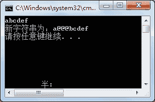

# C# Insert：字符串插入

> 原文：[`c.biancheng.net/view/2838.html`](http://c.biancheng.net/view/2838.html)

在一个字符串中可以在指定位置插入另一个字符串，在 C# 中插入字符串使用的方法是 Insert 方法。

在 Insert 方法中需要两个参数，一个是字符串插入的位置，一个是字符串。

【实例】在 Main 方法中从控制台输入一个字符串，然后将‘@@@’插入到字符串的第 2 个字符的位置。

根据题目要求，代码如下。

```

class Program
{
    static void Main(string[] args)
    {
        string str = Console.ReadLine();
        str = str.Insert(1, "@@@");
        Console.WriteLine("新字符串为：" + str);
    }
}
```

执行上面的代码，效果如下图所示。


从上面的执行效果可以看出，已经将‘@@@’插入到第 2 个字符的位置。