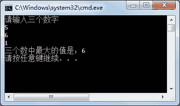

# C# Parse 方法：字符串类型转换

> 原文：[`c.biancheng.net/view/2842.html`](http://c.biancheng.net/view/2842.html)

C# Parse 方法用于将字符串类型转换成任意类型，具体的语法形式如下。

数据类型   变量二数据类型.Parse(字符串类型的值);

这里要求等号左、右两边的数据类型兼容。

【实例】在 Main 方法中从控制台输入 3 个数，并将其中的最大数输出。

根据题目要求，代码如下。

```

class Program
{
    static void Main(string[] args)
    {
        Console.WriteLine("请输入三个数字");
        int num1 = int.Parse(Console.ReadLine());
        int num2 = int.Parse(Console.ReadLine());
        int num3 = int.Parse(Console.ReadLine());
        int maxvalue = num1;
        if (num2 > maxvalue)
        {
            maxvalue = num2;
        }
        if (num3 > maxvalue)
        {
            maxvalue = num3;
        }
        Console.WriteLine("三个数中最大的值是：" + maxvalue);
    }
}
```

执行上面的代码，效果如下图所示。


在上面的实例中使用 Parse 方法将字符串类型转换成了整数类型 int，但输入的字符串必须是数字并且不能超出 int 类型的取值范围。