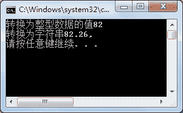

# C# Convert 方法：数据类型转换

> 原文：[`c.biancheng.net/view/2843.html`](http://c.biancheng.net/view/2843.html)

C# Convert 方法是数据类型转换中最灵活的方法，它能够将任意数据类型的值转换成任意数据类型，前提是不要超出指定数据类型的范围。

具体的语法形式如下。

数据类型  变量名 = convert.To 数据类型(变量名);

这里 Convert.To 后面的数据类型要与等号左边的数据类型相匹配。

Convert 类常用的类型转换方法如下表所示。

| 方法 | 说明 |
| Convert.ToInt16() | 转换为整型(short) |
| Convert.ToInt32() | 转换为整型(int) |
| Convert.ToInt64() | 转换为整型(long) |
| Convert.ToChar() | 转换为字符型(char) |
| Convert.ToString() | 转换为字符串型(string) |
| Convert.ToDateTime() | 转换为日期型(datetime) |
| Convert.ToDouble() | 转换为双精度浮点型(double) |
| Conert.ToSingle() | 转换为单精度浮点型(float) |

对于整型和浮点型的强制数据类型操作也可以使用 Convert 方法代替，但是依然会损失存储范围大的数据类型的精度。

【实例】使用 Convert 方法将分别将一个浮点型数据转换成整型和字符串型。

根据题目要求，代码去下。

```

class Program
{
    static void Main(string[] args)
    {
         float num1 = 82.26f;
         int integer;
         string str;
         integer = Convert.ToInt32(num1);
         str = Convert.ToString(num1);
         Console.WriteLine("转换为整型数据的值{0}", integer);
         Console.WriteLine("转换为字符串{0},",str);
    }
}

```

执行上面代码，效果如下图所示。

