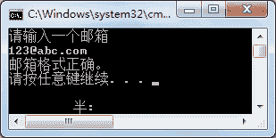

# C#正则表达式（Regex 类）

> 原文：[`c.biancheng.net/view/2846.html`](http://c.biancheng.net/view/2846.html)

正则表达式的主要作用是验证字符串的值是否满足一定的规则，在页面输入数据验证方面的应用比较多。

例如验证输入的邮箱是否合法、输入的身份证号码是否合法、输入的用户名是否满足条件等。

正则表达式并不是 C# 语言独有的，在大多数的编程语言中都是支持的，包括一些脚本语言也支持，例如 JavaScript、JQucry 等。

正则表达式是专门处理字符串操作的，其本身有固定的写法。

正则表达式的符号主要分为元字符和表示重复的字符，分别如下表所示。

正则表达式中的元字符

| 编号 | 字符 | 描述 |
| 1 | . | 匹配除换行符以外的所有字符 |
| 2 | \w | 匹配字母、数字、下画线 |
| 3 | \s | 匹配空白符（空格） |
| 4 | \d | 匹配数字 |
| 5 | \b | 匹配表达式的开始或结束 |
| 6 | ^ | 匹配表达式的开始 |
| 7 | $ | 匹配表达式的结束 |

正则表达式中表示重复的字符

| 编 号 | 字 符 | 描 述 |
| 1 | * | 0 次或多次字符 |
| 2 | ? | 0 次或 1 次字符 |
| 3 | + | 1 次或多次字符 |
| 4 | {n} | n 次字符 |
| 5 | {n,M}  | n 到 M 次字符 |
| 6 | {n, } | n 次以上字符 |

此外，在正则表达式中使用`|`分隔符表示多个正则表达式之间的或者关系，也就是在匹配某一个字符串时满足其中一个正则表达式即可。

例如使用正则表达式来验证身份证信息，第一代身份证是由 15 个数字构成的，第二代身份证是由 18 个数字构成的，正则表达式可以写成 `\d{15}|\d{18}`。

在 C# 语言中使用正则表达式时要用到 Regex 类,该类在 System.Text.RegularExpressions 名称空间中。

在 Regex 类中使用 IsMatch 方法判断所匹配的字符串是否满足正则表达式的要求。

【实例】在 Main 方法中从控制台输入一个邮箱，使用正则表达式判断其正确性。

根据题目要求，在本例中邮箱验证的正则表达式的写法是包含 @，在 @ 前面是字母或者数字、下画线，在 @ 后面也是字母或者数字、下画线，并且字母后面要含有.，在 . 后面还要加上字母或者数字、下画线。具体的代码如下。

```

class Program
{
    static void Main(string[] args)
    {
        Console.WriteLine("请输入一个邮箱");
        string email = Console.ReadLine();
        Regex regex = new Regex(@"^(\w)+(\.\w)*@(\w)+((\.\w+)+)$");
        if (regex.IsMatch(email))
        {
            Console.WriteLine("邮箱格式正确。");
        }
        else
        {
            Console.WriteLine("邮箱格式不正确。");
        }
    }
}
```

执行上面的代码，效果如下图所示。


邮箱的正则表达式也有多种写法，上面的写法只是其中的一种，例如将实例中的`\w`替换成`[a-zA-Z0-9_]`。

此外，在 Regex 类中还提供了很多方法来操作正则表达式

| 字符 | 描述 |
| \ | 转义字符，将一个具有特殊功能的字符转义为一个普通字符，或反过来 |
| (pattern) | 匹配 pattern 并获取这一匹配 |
| (?:pattern) | 匹配 pattern 但不获取匹配结果 |
| (?=pattern)  | 正向预查，在任何匹配 pattern 的字符串开始处匹配查找字符串 |
| (?!pattern) | 负向预查，在任何不匹配 pattern 的字符串开始处匹配查找字符串 |
| x&#124;y | 匹配 x 或 y。例如，‘z&#124;food’能匹配“z”或“food”。‘(z&#124;f)ood’则匹配“zood”或“food” |
| [xyz] | 字符集合。匹配所包含的任意一个字符。例如，‘[abc]’可以匹配“plain”中的‘a’ |
| [^xyz]  | 负值字符集合。匹配未包含的任意字符。例如，‘[^abc]’可以匹配“plain”中的‘p’ |
| [a-z] | 匹配指定范围内的任意字符。例如，‘[a-z]’可以匹配'a'到'z'范围内的任意小写字母字符 |
| [^a-z] | 匹配不在指定范围内的任意字符。例如，‘[^a-z]’可以匹配不在‘a’～‘z’'内的任意字符 |
| \B | 匹配非单词边界 |
| \D | 匹配一个非数字字符，等价于 [⁰-9] |
| \f  | 匹配一个换页符 |
| \n | 匹配一个换行符 |
| \r | 匹配一个回车符 |
| \S | 匹配任何非空白字符 |
| \t | 匹配一个制表符 |
| \v | 匹配一个垂直制表符。等价于 \x0b 和 \cK |
| \W | 匹配任何非单词字符。等价于‘[^A-Za-z0-9_]’ |

除了邮箱的正则表达式以外，还有一些常用的正则表达式，如下表所示。

| 编号 | 正则表达式 | 作用 |
| 1 | \d{15}&#124;\d{18} | 验证身份证号码（15 位或 18 位） |
| 2 | \d{3}-\d{8}&#124;\d{4}-\d{7}  | 验证国内的固定电话（区号有 3 位或 4 位，并在区号和电话号码之 间加上-） |
| 3 | ^[1-9]\d*$  | 验证字符串中都是正整数 |
| 4 | ^-[1-9]\d*$ | 验证字符串中都是负整数 |
| 5 | ^-?[1-9]\d*$ | 验证字符串中是整数 |
| 6 | ^[A-Za-z]+$ | 验证字符串中全是字母 |
| 7 | A[A-Za-z0-9]+$ | 验证字符串由数字和字母构成 |
| 8 | [\u4e00-\u9fa5] | 匹配字符串中的中文 |
| 9 | [^\x00-\xff]  | 匹配字符串中的双字节字符（包括汉字） |