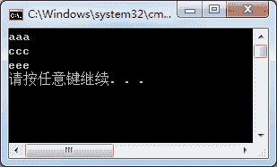
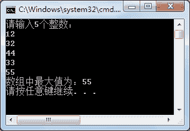

# C#一维数组

> 原文：[`c.biancheng.net/view/2848.html`](http://c.biancheng.net/view/2848.html)

一维数组在数组中最常用，即将一组值存放到一个数组中，并为其定义一个名称，通过数组中元素的位置来存取值。

创建一维数组的语法形式如下。

//定义数组
数据类型[]  数组名；

//初始化数组中的元素
数据类型[]  数组名 = new  数据类型[长度];
数据类型[]  数组名 = {值 1, 值 2, ...}
数据类型[]  数组名 = new  数据类型[长度]{值 1，值 2,...}

在定义数组时定义的数据类型代表了数组中每个元素的数据类型。

在使用数组前必须初始化数据，即为数组赋初值。

在初始化数组时指定了数组中的长度，也就是数组中能存放的元素个数。

在指定数组的长度后，数组中的元素会被系统自动赋予初始值，与类中段的初始化类似，数值类型的值为 0、引用类型的值为 null。

如果在初始化数组中直接对数组赋值了，那么数组中值的个数就是数组的长度。

由于在数组中存放了多个元素，在存取数组中的元素时要使用下标来存取，类似于取字符串中的字符。

例如有一个 int 类型的数组，输出数组中的第一个元素和最后一个元素，语句如下。

```

//定义 int 类型的数组
int[] a = {1,2,3};
//输岀数组中的一个元素
Console.WriteLine(a[0]);
//输出数组中的最后一个元素
Console.WriteLine(a[a.Length-1]);
```

获取数组的长度使用的是数组的`Length`属性，数组的下标仍然从 0 开始，数组中的最后一个元素是数组的长度减 1。

【实例 1】在 Main 方法中创建一个字符串类型的数组，并存入 5 个值，然后将数组中下标是偶数的元素输出。

根据题目要求，代码如下。

```

class Program
{
    static void Main(string[] args)
    {
        string[] strs = { "aaa", "bbb", "ccc", "ddd", "eee" };
        for(int i = 0; i < strs.Length; i = i + 2)
        {
            Console.WriteLine(strs[i]);
        }
    }
}
```

执行上面的代码，效果如下图所示。


从上面的执行效果可以看出，输出的是数组中的第 1 个、第 3 个、第 5 个元素，但是下标却是 0、2、4。

【实例 2】在 Main 方法中创建 int 类型数组，并从控制台输入 5 个值存入该数组中，最后将数组中的最大数输出。

根据题目要求，代码如下。

```

class Program
{
    static void Main(string[] args)
    {
        int[] a = new int[5];
        Console.WriteLine("请输入 5 个整数：");
        for(int i = 0; i < a.Length; i++)
        {
            a[i] = int.Parse(Console.ReadLine());//将字符串类型转换成整型
        }
        int max = a[0];//这里假设 a[0]是最大的
        for(int i = 1; i < a.Length; i++)
        {
            if (a[i] > max)
            {
                max = a[i];
            }
        }
        Console.WriteLine("数组中最大值为：" + max);
    }
}
```

执行上面的代码，效果如下图所示。

