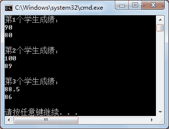
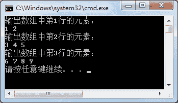

# C#多维数组

> 原文：[`c.biancheng.net/view/2849.html`](http://c.biancheng.net/view/2849.html)

在上一节《C#一维数组》中我们讲到访问一维数组中的元素时使用的是一个下标，例如 a[0]，而多维数组使用多个下标来访问，例如 a[0,0]、a[1,0,0] 等。

在 C# 语言里多维数组中比较常用的是二维数组，这也是本书中对多维数组介绍的重点。

定义多维数组的语法形式如下。

//定义多维数组
数据类型[ , , ...]  数组名;

//创建多维数组并初始化
数据类型[ , , ...]   数组名 = new  数据类型[m,n,...]  {{ , , ...},{ , , ...}};

从上面定义的语法可以看出，它与一维数组的定义非常类似，每多一个维度则在定义时的`[]`中增加一个“,”。

存取数组中的值也是将下标用“,”隔开。

【实例 1】在 Main 方法中定义一个存放学生成绩的二维数组，并将该数组中每个学生的成绩输出。

根据题目要求，定义二维数组为 double 类型的，代码如下。

```

class Program
{
    static void Main(string[] args)
    {
        double[,] points = { { 90, 80 }, { 100, 89 }, { 88.5, 86 } };
        for(int i = 0; i < points.GetLength(0); i++)
        {
            Console.WriteLine("第" + (i + 1) + "个学生成绩：");
            for(int j = 0; j < points.GetLength(1); j++)
            {
                Console.Write(points[i, j] + " ");
            }
            Console.WriteLine();
        }
    }
}
```

执行上面的代码，效果如下图所示。


在遍历多维数组元素时使用 GetLength(维度) 方法能获取多维数组中每一维的元素，维度也是从 0 开始的，因此在该实例中获取数组中第一维的值时使用的是 points.GetLength(0)。

在 C# 语言中不仅支持上面给出的多维数组，也支持锯齿型数组，即在多维数组中的每一维中所存放值的个数不同。

锯齿型数组也被称为数组中的数组。定义锯齿型数组的语法形式如下。

数据类型[][]  数组名 = new 数据类型[数组长度][];
数组名[0] = new 数据类型[数组长度];

在这里，数据类型指的是整个数组中元素的类型，在定义锯齿型数组时必须要指定维度。

【实例 2】在 Main 方法中创建一个锯齿型数组，第一维数组的长度是 2、第二维数组的长度是 3、第三维数组的长度是 4，并直接向数组中赋值，最后输出数组中的元素。

根据题目要求，代码如下。

```

class Program
{
    static void Main(string[] args)
    {
        int[][] arrays = new int[3][];
        arrays[0] = new int[] { 1, 2 };
        arrays[1] = new int[] { 3, 4, 5 };
        arrays[2] = new int[] { 6, 7, 8, 9 };
        for(int i = 0; i < arrays.Length; i++)
        {
            Console.WriteLine("输出数组中第" + (i + 1) + "行的元素：");
            for(int j=0;j<arrays[i].Length; j++)
            {
                Console.Write(arrays[i][j] + " ");
            }
            Console.WriteLine();
        }
    }
}
```

执行上面的代码，效果如下图所示。


锯齿型数组中的值也可以通过循环语句来赋值，与输岀语句类似。

在上面的实例中, arrays 数组中的元素从控制台输入的具体语句如下。

```

int[][] arrays = new int[3][];
arrays[0] = new int[2];
arrays[1] = new int[3];
arrays[2] = new int[4];
for(int i = 0; i < arrays.Length; i++)
{
    Console.WriteLine("输入数组中第" + (i + 1) + "行的元素：");
    for(int j=0;j<arrays[i].Length; j++)
    {
        arrays[i][j] = int.Parse(Console.ReadLine());
    }
    Console.WriteLine();
}
```