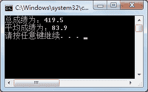

# C# foreach 循环用法详解

> 原文：[`c.biancheng.net/view/2851.html`](http://c.biancheng.net/view/2851.html)

C# foreach 循环用于列举出集合中所有的元素，foreach 语句中的表达式由关键字 in 隔开的两个项组成。

in 右边的项是集合名，in 左边的项是变量名，用来存放该集合中的每个元素。

该循环的运行过程如下：每一次循环时，从集合中取出一个新的元素值。放到只读变量中去，如果括号中的整个表达式返回值为 true，foreach 块中的语句就能够执行。

一旦集合中的元素都已经被访问到，整个表达式的值为 false，控制流程就转入到 foreach 块后面的执行语句。

foreach 语句经常与数组一起使用，在 C# 语言中提供了 foreach 语句遍历数组中的元素，具体的语法形式 如下。

foreach(数据类型  变量名  in  数组名)
{
    //语句块；
}

这里变量名的数据类型必须与数组的数据类型相兼容。

在 foreach 循环中，如果要输出数组中的元素，不需要使用数组中的下标，直接输出变量名即可。

foreach 语句仅能用于数组、字符串或集合类数据类型。

【实例】在 Main 方法中创建一个 double 类型的数组，并在该数组中存入 5 名学生的考试成绩，计算总成绩和平均成绩。

根据题目要求，使用 foreach 语句实现该功能，代码如下。

```

class Program
{
    static void Main(string[] args)
    {
        double[] points = { 80, 88, 86, 90, 75.5 };
        double sum = 0;
        double avg = 0;
        foreach(double point in points)
        {
            sum = sum + point;
        }
        avg = sum / points.Length;
        Console.WriteLine("总成绩为：" + sum);
        Console.WriteLine("平均成绩为：" + avg);
    }
}
```

在计算平均成绩时，通过数组的 Length 属性即可得到数组中元素的个数，使用总成绩除以元素的个数即为结果。

执行上面的语句，效果如下图所示。


从上面的执行效果可以看出，在使用 foreach 语句时可以免去使用下标的麻烦，这也 给遍历数组中的元素带来很多方便。