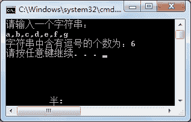
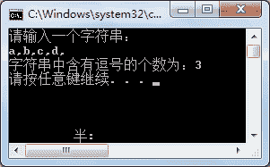

# C# Split：将字符串拆分为数组

> 原文：[`c.biancheng.net/view/2853.html`](http://c.biancheng.net/view/2853.html)

C# Split 方法用于按照指定的字符串来拆分原有字符串，并返回拆分后得到的字符串数组。

下面用两个实例来演示字符串拆分方法的应用。

【实例 1】在 Main 方法中从控制台输入一个字符串，然后计算该字符串中包含的逗号的个数。

根据题目要求，如果要查询逗号的个数，通过拆分方法 Split 将拆分结果存放到字符串数组中，数组的长度减 1 即为字符串中含有逗号的个数，代码如下。

```

class Program
{
    static void Main(string[] args)
    {
        Console.WriteLine("请输入一个字符串：");
        string str = Console.ReadLine();
        string[] condition = { "," };
        string[] result = str.Split(condition, StringSplitOptions.None);
        Console.WriteLine("字符串中含有逗号的个数为：" + (result.Length - 1));
    }
}
```

执行上面的代码，效果如下图所示。


在使用 Split 方法时，需要注意该方法中传递的参数 (condition, StringSplitOptions.None)。

第一个参数是拆分的条件数组，可以在该数组中存放多个字符串作为拆分的条件。

第二个 参数 StringSplitOptions.None 是拆分的选项，表示如果在拆分时遇到空字符也拆分出一个元素。

如果在拆分时不需要包含空字符串，则可以使用 StringSplitOptions.RemoveEmptyEntries 选项，例如在上例中将 StringSplitOptions.None 更改成 StringSplitOptions.RemoveEmptyEntries, 语句如下。

```

class Program
{
    static void Main(string[] args)
    {
        Console.WriteLine("请输入一个字符串：");
        string str = Console.ReadLine();
        string[] condition = { "," };
        string[] result = str.Split(condition, StringSplitOptions.RemoveEmptyEntries);
        Console.WriteLine("字符串中含有逗号的个数为：" + (result.Length - 1));
    }
}
```

仍然执行该实例中所输入的字符串，效果如下图所示。


从上面的执行效果可以看出，逗号的个数为 3，而前面的例子中逗号的个数为 4，这是因为当拆分“a,b,c,d,”时，最后一个逗号拆分后逗号后面的值是一个空格，因此拆分结果中数组的元素个数为 4 而不是 5。

在实际应用中，用户应根据具体情况选择拆分选项的不同值。