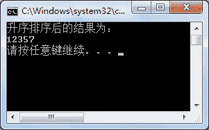
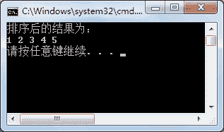

# C#冒泡排序（Sort 方法）

> 原文：[`c.biancheng.net/view/2854.html`](http://c.biancheng.net/view/2854.html)

冒泡排序在应聘的笔试题目中经常被考到，冒泡排序的原理是将数组元素中相邻两个元素的值进行比较，将较小的数放到前面，每一次交换都将最大的数放到最后，依次交换后最终将数组中的元素从小到大排序。

下面通过几个实例来演示 C# 中冒泡排序是如何实现的。

【实例 1】在 Main 方法中创建一个整型数组，并在该数组中存放 5 个元素，使用冒泡排序算法将数组中的元素从小到大排序。

根据题目要求，代码如下。

```

class Program
{
    static void Main(string[] args)
    {
        int[] a = { 5, 1, 7, 2, 3 };
        for(int i = 0; i < a.Length; i++)
        {
            for(int j = 0; j < a.Length - i - 1; j++)
            {
                if (a[j] > a[j + 1])
                {
                    int temp = a[j];
                    a[j] = a[j + 1];
                    a[j + 1] = temp;
                }
            }
        }
        Console.WriteLine("升序排序后的结果为：");
        foreach(int b in a)
        {
            Console.Write(b + "");
        }
        Console.WriteLine();
    }
}
```

执行上面的代码，效果如下图所示。


如果要对数组中的元素从大到小排序，只需要将 if(a[j]>a[j+1]) 语句更改成 if(a[j]<a[j+1]) 即可。

System.Array 是所有数组的基类，其提供的属性和方法也可以被用到任何数组中。

例如前面使用的 Length 属性也是该基类中提供的。

数组中常用的方法如下表所示。

| 编号 | 方法 | 描述 |
| 1 | Clear() | 清空数组中的元素 |
| 2 | Sort() | 冒泡排序，从小到大排序数组中的元素 |
| 3 | Reverse() | 将数组中的元素逆序排列 |
| 4 | IndexOf() | 查找数组中是否含有某个元素，返回该元素第一次出现的位置，如果没有与之匹配的元素，则返回 -1 |
| 5 | LastIndexOf() | 查找数组中是否含有某个元素，返回该元素最后一次出现的位置 |

【实例 2】使用数组中的 Sort 方法完成对数组元素的排序。

根据题目要求，代码如下。

```

class Program
{
    static void Main(string[] args)
    {
        int[] a = { 5, 3, 2, 4, 1 };
        Array.Sort(a);
        Console.WriteLine("排序后的结果为：");
        foreach(int b in a)
        {
            Console.Write(b + " ");
        }
        Console.WriteLine();
    }
}
```

执行上面的代码，效果如下图所示。


虽然在数组中并没有提供对其降序排序的方法，但可以先将数组中的元素使用 Sort 排序,再使用 Reverse 方法将数组中的元素逆序，这样就完成了从大到小的排序。