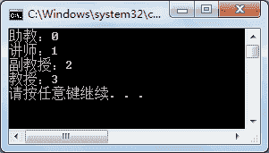
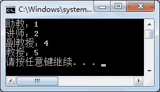
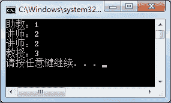

# C# enum：枚举类型

> 原文：[`c.biancheng.net/view/2856.html`](http://c.biancheng.net/view/2856.html)

C#枚举类型和结构体类型都是特殊的值类型，应用也比较广泛。

枚举类型与《C#一维数组》一节中介绍的数组比较接近，它可以将一组值存放到一个变量名下，方便调用。

例如，在《C# Split》一节中介绍的拆分方法中的字符串拆分选项 StringSplitOptions 就是一个枚举类型，在该类型中有两个值，分别是 None 和 RemoveEmptyEntries。

结构体类型将在下一节《C#结构体类型》中为大家讲解。

枚举类型是一种值类型，定义好的值会存放到栈中。

枚举类型在定义时使用 enum 关键字表示，枚举类型的定义与类成员的定义是一样的，或者直接定义在命名空间中。

> 注意不能直接将枚举类型定义到方法中。

定义枚举类型的变量的语法形式如下。

访问修饰符  enum  变量名 : 数据类型
{
    值 l,
    值 2,
}

其中：

#### 1) 访问修饰符

与类成员的访问修饰符一样，省略访问修饰符也是代表使用 private 修饰符的。

#### 2) 数据类型

指枚举中值的数据类型。只能是整数类型，包括 byte、short、int、long 等。

#### 3) 值 1、值 2、……

在枚举类型中显示的值。但实际上每个值都被自动赋予了一个整数类型值，并且值是递增加 1 的，默认是从 0 开始的，也就是值 1 的值是 0、值 2 的值是 1。

如果不需要系统自动为枚举值指定值，也可以直接为其赋一个整数值。

每个没有指定值的枚举值，它的初始值都是上一个枚举类型的值加 1。

通常设置的枚举值都是不同的，其整数值也是不同的。

【实例 1】创建类 EnumTest,在该类中定义一个枚举类型存放教师职称（助教、讲师、副教授、教授）。在 Main 方法中分别打印出每个枚举值对应的整数值。

根据题目要求，代码如下。

```

class EnumTest
{
    public enum Title : int
    {
        助教,
        讲师,
        副教授,
        教授
    }
}
```

获取并输出枚举值，在 Main 方法中调用的代码如下。

```

class Program
{
    static void Main(string[] args)
    {
        Console.WriteLine(EnumTest.Title.助教 + "：" + (int)EnumTest.Title.助教);
        Console.WriteLine(EnumTest.Title.讲师 + "：" + (int)EnumTest.Title.讲师);
        Console.WriteLine(EnumTest.Title.副教授 + "：" + (int)EnumTest.Title.副教授);
        Console.WriteLine(EnumTest.Title.教授 + "：" + (int)EnumTest.Title.教授);
    }
}
```

从上面的代码可以看出，由于枚举类型定义的类与 Main 方法所在的类不同，因此如果要使用该枚举值，需要使用“类名 . 枚举变量名”表示。

获取枚举类型中设置的值使用的语句是“类名 . 枚举变量名 . 枚举值”，在获取枚举类型中的每个枚举值对应的整数值时需要将枚举类型的字符串值强制转换成整型。

执行上面的代码，效果如下图所示。


从上面的执行效果可以看出，由于没有给枚举值设置初始的整数值，初始的整数值是从 0 开始的，并且依次递增 1。

如果将助教的值设置为 1,将副教授的值设置为 4,代码如下。

```

class EnumTest
{
    public enum Title : int
    {
        助教=1,
        讲师,
        副教授=4,
        教授
    }
}
```

修改后再次运行上面的代码，执行效果如下图所示。


从上面的执行效果可以看出，当助教的值为 1 时，讲师的值为 2，而由于副教授的值被设置为 4，则教授的值为 5。

因此，每个枚举值的整数值都是前一个枚举值的整数值加 1。

如果将上述枚举类型中的副教授的枚举值的整数值设置为 2，则再次执行上面的代码， 效果如下图所示。


从上面的执行效果可以看出，如果将枚举值的整数值设置为相同，则输出的值也会与前面的枚举值相同。

因此在定义枚举类型时，要保证枚举值的唯一性，以免影响枚举类型的应用。