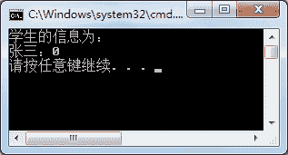
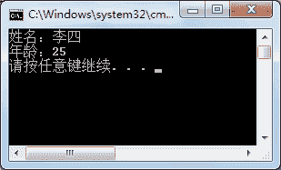

# C# struct：结构体类型

> 原文：[`c.biancheng.net/view/2858.html`](http://c.biancheng.net/view/2858.html)

结构体与类比较相似，由于它是值类型，在使用时会比使用类存取的速度更快，但灵活性方面没有类好。

结构体从字面上来理解是指定义一种结构，实际上结构体是一种与类的定义非常相似的数据类型，但它是值类型。

结构体的定义位置与枚举类型一样，都是在类中定义或者在命名空间下定义，而不能将其定义到方法中。

在结构体中能定义字段、属性、方法等成员。定义的语法形式如下。

访问修饰符  struct  结构体名称
{
    //结构体成员
}

其中：

#### 1) 访问修饰符

通常使用 public 或者省略不写，如果省略不写，代表使用 private 来修饰。

如果结构体中的内容要被其他类中的成员访问，需要将其访问修饰符设置为 public。

#### 2) 结构体名称

命名规则通常和变量的命名规则相同，即从第二个单词开始每个单词的首字母大写。

#### 3) 结构体成员

包括字段、属性、方法以及后面要介绍的事件等。

在结构体中也能编写构造器，但必须带参数，并且必须为结构体中的字段赋初值。

在调用结构体的成员时，能使用不带参数的构造器，与创建类的对象时类似。

【实例 1】定义名为 student 的结构体,在该结构体中定义学生姓名 (name) 和年龄 (age) 的字段，并分别为字段生成属性，要求年龄必须大于 0。

根据题目要求，将结构体 student 定义到 Program 类中，并在 Main 方法中调用该结构体，代码如下。

```

class Program
{
    static void Main(string[] args)
    {
        student stu = new student();
        stu.Name = "张三";
        stu.Age = -100;
        Console.WriteLine("学生的信息为：");
        Console.WriteLine(stu.Name + "：" + stu.Age);
    }
    struct student
    {
        private string name;
        private int age;
        public string Name
        {
            get
            {
                return name;
            }
            set
            {
                name = value;
            }
        }
        public int Age
        {
            get
            {
                return age;
            }
            set
            {
                if (value < 0)
                {
                    value = 0;
                }
                else
                {
                    age = value;
                }
            }
        }
    }
}
```

执行上面的代码，效果如下图所示。


从上面的执行效果可以看出，由于在结构体中将年龄属性设置为如果小于 0，则值为 0 的条件，因此输出结果中年龄为 0。

此外，从调用结构体的代码可以看出，调用结构体和调用类是类似的，是通过构造器来实现的。

当然，在调用结构体时也可以不用构造器。

【实例 2】在结构体中定义带参数的构造器，并在结构体中定义方法输出字段的值。

根据题目要求，代码如下。

```

class Program
{
    static void Main(string[] args)
    {
        student stu = new student("李四",25);
        stu.PrintStudent();
    }
}
public struct student
{
    public student(string name, int age)
    {
        this.name = name;
        this.age = age;
    }
    private string name;
    private int age;
    public void PrintStudent()
    {
        Console.WriteLine("姓名：" + name);
        Console.WriteLine("年龄：" + age);
    }
}
```

执行上面的代码，效果如下图所示。


结构体与类有些类似，但其定义却有很大区别，具体如下表所示。

| 结构体 | 类 |
| 允许不使用 new 对其实例化  | 必须使用 new 实例化 |
| 没有默认构造方法 | 有默认构造方法 |
| 不能继承类  | 能继承类 |
| 没有析构方法 | 有析构方法 |
| 不允许使用 abstract、protected 以及 sealed 修饰 | 允许使用 abstract、protected 以及 sealed 修饰 |