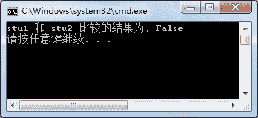

# C# Equals 方法：判断两个对象是否相等

> 原文：[`c.biancheng.net/view/2864.html`](http://c.biancheng.net/view/2864.html)

C# Equals 方法主要用于比较两个对象是否相等，如果相等则返回 True,否则返回 False。

如果是引用类型的对象，则用于判断两个对象是否引用了同一个对象。

在 C# 语言中，Equals 方法提供了两个，一个是静态的，一个是非静态的，具体的定义如下。

```

Equals (object ol, object o2); //静态方法
Equals (object o); //非静态方法
```

下面通过实例演示 Equals 方法的使用。

【实例】使用 Equals 方法判断两个对象是否引用了 Student 对象。

根据题目要求，首先创建 Student 类，由于并不需要使用该类的成员，在类中不必写 任何代码，创建 Student 类的代码如下。

```

class Student{};
```

创建两个 Student 类的对象，并使用 Equals 方法比较类的对象，代码如下。

```

class Program
{
    static void Main(string[] args)
    {
        Student stu1 = new Student();
        Student stu2 = new Student();
        bool flag = Equals(stu1, stu2);
        Console.WriteLine("stu1 和 stu2 比较的结果为，{0}", flag);
    }
}
```

执行上面的代码，效果如下图所示。


从上面的执行效果可以看出，Stu1 和 Stu2 引用的并不是同一个对象。如果将代码更改为：

```

Student stu2=stu1;
```

这样使用 Equals 方法判断的结果才为 True。如果使用 Equals(object o)方法比较 stul 和 stu2 的值，代码如下。

```

stul.Equals(stu2);
```