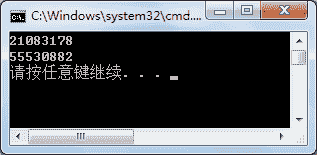

# C# GetHashCode 方法：获取哈希码

> 原文：[`c.biancheng.net/view/2865.html`](http://c.biancheng.net/view/2865.html)

C# GetHashCode 方法返回当前 System.Object 的哈希代码，每个对象的哈希值都是固定的。

该方法不含有任何参数，并且不是静态方法，因此需要使用实例来调用该方法。

由于该方法是在 Object 类中定义的，因此任何对象都可以直接调用该方法。

下面通过实例来演示该方法的使用。

【实例】创建两个 Student 类的对象，并分别计算其哈希值。

根据题目要求，代码如下。

```

class Program
{
    static void Main(string[] args)
    {
        Student stu1 = new Student();
        Student stu2 = new Student();
        Console.WriteLine(stu1.GetHashCode());
        Console.WriteLine(stu2.GetHashCode());
    }
}
```

执行上面的代码，效果如下图所示。


从上面的执行效果可以看出，不同实例的哈希值是不同的，因此也可以通过该方法比较对象是否相等。