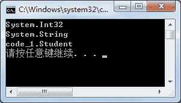

# C# GetType 方法：获取对象 type 类型

> 原文：[`c.biancheng.net/view/2866.html`](http://c.biancheng.net/view/2866.html)

C# GetType 方法用于获取当前实例的类型，返回值为 System.Type 类型。

C# GetType 方法不含任何参数，是非静态方法。

其调用与上一节《C# GetHashCode 方法》介绍的 GetHashCode() 方法类似，使用任何对象都能直接调用该方法。

下面通过实例来演示该方法的使用。

【实例】创建字符串类型的变量、整数类型的变量以及 Student 类的对象，并分别使用 GetType 方法获取其类型并输出。

根据题目要求，代码如下。

```

class Program
{
    static void Main(string[] args)
    {
        int i = 100;
        string str = "abc";
        Student stu = new Student();
        Console.WriteLine(i.GetType());
        Console.WriteLine(str.GetType());
        Console.WriteLine(stu.GetType());
    }
}
```

执行上面的代码，效果如下图所示。


从上面的执行效果可以看出，每一个变量都通过 GetType 方法获取了其类型，通常可以使用该方法比较某些对象是否为同一类型的。