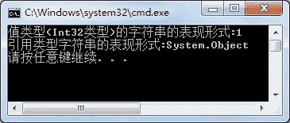

# C# ToString 方法：返回对象实例的字符串

> 原文：[`c.biancheng.net/view/2867.html`](http://c.biancheng.net/view/2867.html)

C# ToString 方法返回一个对象实例的字符串，在默认情况下将返回类类型的限定名。

C# 中几乎所有的类型都派生自 Object，所以如果当前类型没有重写 ToString() 方法的情况下，调用 ToString() 方法，默认返回当前类型的名称。

任何类都可以重写 ToString 方法，返回自定义的字符串。

对于其他的值类型，则为将值转换为字符串类型的值。

【实例】创建整数类型的变量以及 Object 类的对象，并分别使用 ToString 方法获取其字符串的表现形式并输出。

根据题目要求，代码如下。

```

class Program
{
    static void Main(string[] args)
    {
        Int32 a = 1;
        Object b = new Object();
        Console.WriteLine("值类型(Int32 类型)的字符串的表现形式:{0}", a.ToString());
        Console.WriteLine("引用类型字符串的表现形式:{0}", b.ToString());
    }
}
```

执行上面的代码，效果如下图所示。

