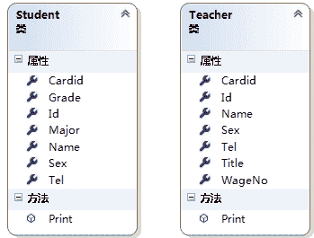

# C# VS2015 类图的使用

> 原文：[`c.biancheng.net/view/2870.html`](http://c.biancheng.net/view/2870.html)

在 Visual Studio 2015 中提供了类图功能，可以将类直接转换成类图的形式。

在开发软件时，经常会在详细设计阶段使用类图的形式来表示类。

在 Visual Studio 2015 中将类文件转换成类图非常简单，直接右击类文件,在右键菜单中选择“查看类图”命令。

效果如下图所示。


假设要完成一个学校的校园管理信息系统，在员工管理系统中有不同的人员信息，包括学生信息、教师信息等。

学生信息、教师信息会有一些公共的信息，例如人员编号、姓名、性别、身份证号、联系方式都是共有的。

直接为学生信息、教师信息创建两个类，并在两个类中分别定义属性和方法，在学生类中定义编号（Id）、姓名（Name）、性别（Sex）、身份证号（Cardid）、联系方式（Tel）、专业（Major）、年级（Grade）7 个属性，并定义一个方法在控制台输出这些属性的值。

学生信息类（Student）的代码如下。

```

class Student
{
    public int Id { get; set; }
    public string Name { get; set; }
    public string Sex { get; set; }
    public string Cardid { get; set; }
    public string Tel { get; set; }
    public string Major { get; set; }
    public string Grade { get; set; }
    public void Print()
    {
        Console.WriteLine("编号：" + Id);
        Console.WriteLine("姓名：" + Name);
        Console.WriteLine("性别：" + Sex);
        Console.WriteLine("身份证号：" + Cardid);
        Console.WriteLine("联系方式：" + Tel);
        Console.WriteLine("专业：" + Major);
        Console.WriteLine("年级：" + Grade);
    }
}
```

用同样的方法创建教师信息类（Teacher），属性包括编号（Id）、姓名（Name）,性别 （Sex）、身份证号（Cardid）、联系方式（Tel）、职称（Title）、工资号（Wageno），并将上 述属性输岀到控制台。

教师信息类（Teacher）的代码如下。

```

class Teacher
{
    public int Id { get; set; }
    public string Name { get; set; }
    public string Sex { get; set; }
    public string Cardid { get; set; }
    public string Tel { get; set; }
    public string Title { get; set; }
    public string WageNo { get; set; }
    public void Print()
    {
        Console.WriteLine("编号：" + Id);
        Console.WriteLine("姓名：" + Name);
        Console.WriteLine("性别：" + Sex);
        Console.WriteLine("身份证号：" + Cardid);
        Console.WriteLine("联系方式：" + Tel);
        Console.WriteLine("职称：" + Title);
        Console.WriteLine("工资号：" + WageNo);
    }
}
```

可以看到 Student 类和 Teacher 类的代码中存在很多重复的代码，如果再创建管理人员信息类或者其他的人员信息类，还会出现很多重复的代码，这样会造成大量的代码冗余。

使用类图可以清晰地看到类文件中定义的属性和方法。同样，Teacher 类对应的类图如下图所示。


从 Student 类和 Teacher 类的类图中可以看到它们有很多重复的属性，如果将这些属性单独写到一个文件中，Student 类和 Teacher 类在使用这些属性和方法时直接复制这个文件中的内容就方便多了。

在 C# 语言中提供的继承特性就是解决上述问题的，将 Student 类和 Teacher 类中共有的 属性抽取出来定义为一个类，然后 Student 类和 Teacher 类都继承这个共有属性类即可。

假设将共有属性类定义为 Person，在类中定义属性和方法的代码如下。

```

class Person
{
    public int Id { get; set; }
    public string Name { get; set; }
    public string Sex { get; set; }
    public string Cardid { get; set; }
    public string Tel { get; set; }
    public void Print()
    {
        Console.WriteLine("编号：" + Id);
        Console.WriteLine("姓名：" + Name);
        Console.WriteLine("性别：" + Sex);
        Console.WriteLine("身份证号：" + Cardid);
        Console.WriteLine("联系方式：" + Tel);
    }
}
```

创建后的 Person 类对应的类图如下图所示。


如果已经创建了 Person 类，则 Student 类和 Teacher 类中仅保留不同的属性和方法即可。

将 Student 类的代码更改为如下代码。

```

class Student
{
    public string Major { get; set; }
    public string Grade { get; set; }
    public void Print()
    {
        Console.WriteLine("专业：" + Major);
        Console.WriteLine("年级：" + Grade);
    }
}
```

将 Teacher 类的代码更改为如下代码。

```

class Teacher
{
    public string Title { get; set; }
    public string WageNo { get; set; }
    public void Print()
    {
        Console.WriteLine("职称：" + Title);
        Console.WriteLine("工资号：" + WageNo);
    }
}
```

Person、Student、Teacher 类的类图如下图所示。


现在需要借助类的继承功能分别完成 Student 类和 Teacher 类继承 Person 类的操作。

在 C# 语言中实现继承非常容易，只需要用`:`符号即可完成类之间继承的表示。

类之间的继承关系的定义语法形式如下。

访问修饰符  class  ClassA:ClassB
{
    //类成员
}

其中:

*   访问修饰符：包括 public、internal。
*   ClassA：称为子类、派生类，在子类中能直接使用 ClassB 中的成员。
*   ClassB：称为父类、基类。

> 注意：一个类只能有一个父类，但是一个父类可以有多个子类，并且在 C# 语言中继承 关系具有传递性，即 A 类继承 B 类、C 类继承 A 类，则 C 类也相当于继承了 B 类。

Student 类继承 Person 类的代码如下。

```

class Student:Person
{
    public string Major { get; set; }
    public string Grade { get; set; }
    public void Print()
    {
        Console.WriteLine("专业：" + Major);
        Console.WriteLine("年级：" + Grade);
    }
}
```

同样，将 Teacher 类继承 Person 类，生成的类图如下图所示。


在类图中使用箭头表示继承关系，箭头的三角形端指向父类，另一端是子类。