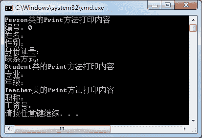
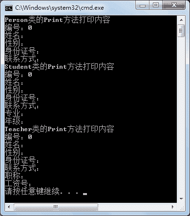

# C# base 关键字：调用父类成员方法

> 原文：[`c.biancheng.net/view/2871.html`](http://c.biancheng.net/view/2871.html)

在上一节《C# VS2015 类图的使用》中介绍的继承关系的类图中可以看出，在每个类中都有 Print 方法，即子类和父类中有同名的方法。

那么这种方式是方法的重载吗？答案是否定的，方法重载是指方法名相同而方法的参数不同的方法。

在 C# 语言中子类中定义的同名方法相当于在子类中重新定义了一个方法，在子类中的对象是调用不到父类中的同名方法的，调用的是子类中的方法。

因此也经常说成是将父类中的同名方法隐藏了。

【实例 1】在 Main 方法中分别创建前面编写过的 Person、Teacher 以及 Student 类的对 象，并调用其中的 Print 方法。

根据题目要求，代码如下。

```

class Program
{
    static void Main(string[] args)
    {
        Person person = new Person();
        Console.WriteLine("Person 类的 Print 方法打印内容");
        person.Print();
        Student student = new Student();
        Console.WriteLine("Student 类的 Print 方法打印内容");
        student.Print();
        Teacher teacher = new Teacher();
        Console.WriteLine("Teacher 类的 Print 方法打印内容");
        teacher.Print();
    }
}
```

执行上面的代码，效果如下图所示。


从上面的执行效果可以看出，在创建不同类的对象后，调用同名的方法 Print 效果是不同的。

创建子类的对象仅能调用子类中的 Print 方法，而与父类中的 Print 方法无关。

在继承的关系中，子类如果需要调用父类中的成员可以借助 base 关键字来完成，具体的用法如下。

base. 父类成员

如果在同名的方法中使用 base 关键字调用父类中的方法，则相当于把父类中的方法内容复制到该方法中。

【实例 2】改写实例 1 中的 Student 和 Teacher 类中同名的 Print 方法，使用 base 关键字 调用父类中的 Print 方法。

根据题目要求，更改后的代码如下。

```

class Teacher:Person
{
    public string Title { get; set; }
    public string WageNo { get; set; }
    public void Print()
    {
        base.Print();
        Console.WriteLine("职称：" + Title);
        Console.WriteLine("工资号：" + WageNo);
    }
}

class Student:Person
{
    public string Major { get; set; }
    public string Grade { get; set; }
    public void Print()
    {
        base.Print();
        Console.WriteLine("专业：" + Major);
        Console.WriteLine("年级：" + Grade);
    }
}
```

在实例 1 的 Main 方法中创建子类对象调用 Print 方法的代码不用修改，重新执行后效 果如下图所示。


从上面的执行效果可以看出，通过 base 关键字调用 Print 方法即可调用在父类中定义的语句。

> 说明：用户在程序中会遇到 this 和 base 关键字，this 关键字代表的是当前类的对象，而 base 关键字代表的是父类中的对象。