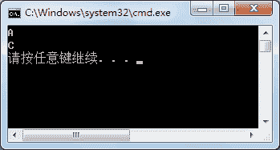

# C# virtual 关键字详解

> 原文：[`c.biancheng.net/view/2873.html`](http://c.biancheng.net/view/2873.html)

C# virtual 是虚拟的含义，在 C# 语言中，默认情况下类中的成员都是非虚拟的，通常将类中的成员定义成虚拟的，表示这些成员将会在继承后重写其中的内容。

virtual 关键字能修饰方法、属性、索引器以及事件等，用到父类的成员中。

使用 virtual 关键字修饰属性和方法的语法形式如下。

//修饰属性
public  virtual  数据类型  属性名{get; set; }

//修饰方法
访问修饰符  virtual  返回值类型方法名
{
    语句块；
}

需要注意的是，virtual 关键字不能修饰使用 static 修饰的成员。

此外，virtual 关键字既可以添加到访问修饰符的后面，也可以添加到访问修饰符的前面，但实际应用中习惯将该关键字放到访问修饰符的后面。

子类继承父类后能重写父类中的成员，重写的关键字是 override。

所谓重写是指子类和父类的成员定义一致，仅在子类中增加了 override 关键字修饰成员。

例如在父类中有一个求长方形面积的方法，方法定义如下。

```

publie int Area（int x, int y）
{
    return x * y
}
```

在子类中重写该方法的代码如下。

public override int Area（int x,int y）
{
    语句块；
    return  整数类型的值;
}

在子类中重写父类中的方法后能改变方法体中的内容，但是方法的定义不能改变。

【实例 1】将上一节《C# base》中定义的 Person 类中的 Print 方法更改为虚拟的方法，分别用 Student 类和 Teacher 类继承 Person 类,并重写 Print 方法，打印出学生信息和教师信息。

为了减少重复的代码，在每个类中省略了属性部分的定义内容，仅保留 Print 方法部分的内容，实现的代码如下。

```

class Person
{
    public virtual void Print()
    {
        Console.WriteLine("编号："+ Id);
        Console.WriteLine("姓名："+ Name);
        Console.WriteLine("性别："+ Sex);
        Console.WriteLine("身份证号："+ Cardid);
        Console.WriteLine("联系方式："+ Tel);
    }
}

class Student:Person
{
    public override void Print()
    {
        Console.WriteLine("编号："+ Id);
        Console.WriteLine("姓名："+ Name);
        Console.WriteLine("性别："+ Sex);
        Console.WriteLine("身份证号："+ Cardid);
        Console.WriteLine("联系方式："+ Tel);
        Console.WriteLine("专业："+ Major);
        Console.WriteLine("年级："+ Grade);
    }
}

class Teacher:Person
{
    public override void Print()
    {
        Console.WriteLine("编号："+ Id);
        Console.WriteLine("姓名："+ Name);
        Console.WriteLine("性别："+ Sex);
        Console.WriteLine("身份证号："+ Cardid);
        Console.WriteLine("联系方式："+ Tel);
        Console.WriteLine("专业："+ Major);
        Console.WriteLine("年级："+ Grade);
    }
}
```

通过上面的代码即可完成对 Person 类中 Print 方法的重写，在重写后的 Print 方法中能直接调用在 Person 类中定义的成员。

但读者会发现在 Person 类的 Print 中已经对 Person 中的相关属性编写了输出操作的代码，而每一个子类中又重复地编写了代码，造成代码的冗余，也没有体现出代码重用的特点。

如果能在重写父类方法的同时直接使用父类中已经编写过的内容就会方便很多。

在重写 Print 方法后仍然需要使用 base 关键字调用父类中的 Print 方法执行相应的操作。

【实例 2】改写实例 1 中的 Student 和 Teacher 类中重写的 Print 方法，使用 base 关键字调用父类中的 Print 方法。

根据题目要求，更改后的代码如下。

```

class Student:Person
{
    public override void Print()
    {
        base.Print ();
        Console.WriteLine("专业："+ Major);
        Console.WriteLine("年级："+ Grade);
    }
}
class Teacher:Person
{
    public override void Print()
    {
        base.Print ();
        Console.WriteLine("专业："+ Major);
        Console.WriteLine("年级："+ Grade);
    }
}
```

从上面的代码可以看出继承给程序带来的好处，不仅减少了代码的冗余，还增强了程序的可读性。

方法隐藏和重写方法有区别吗？这是很多初学者常问的问题。观察以下代码，思考结果会是什么？

```

class Program
{
    static void Main(string[] args)
    {
        A a1 = new B();
        a1.Print();
        A a2 = new C();
        a2.Print();
    }
}
class A
{
    public virtual void Print()
    {
        Console.WriteLine("A");
    }
}
class B :A
{
    public new void Print()
    {
        Console.WriteLine("B");
    }
}
class C :A
{
    public override void Print()
    {
        Console.WriteLine("C");
    }
}
```

执行上面的代码，效果如下图所示。


从上面的执行效果可以看出，使用方法隐藏的方法调用的结果是父类 A 中 Print 方法中的内容，而使用方法重写的方法调用的结果是子类 C 中 Print 方法中的内容。

因此方法隐藏相当于在子类中定义新方法，而方法重写则是重新定义父类中方法的内容。

从上面的代码也可以看出，在“A a1=new B()”语句中 A 类是父类、B 类是子类，相当于将子类转换成父类，即隐式转换。

如果需要将父类转换成子类，则需要强制转换，并且在强制转换前需要先将所需的子类转换成父类，示例代码如下。

```

A a2=new C();
C c=(C) a2;
c.Print();
```

在上面的实例中,a2 是父类对象,然后将其强制转换成 C 类对象。

Object 类中的 ToString 方法能被类重写，并返回所需的字符串，通常将其用到类中返回类中属性的值。

在 Student 类中添加重写的 ToString 方法，代码如下。

```

class Student
{
    public string Major{ get; set;}
    public string Grade{ get; set;}
    public void Print()
    {
        Console.WriteLine("专业："+ Major);
        Console.WriteLine("年级："+ Grade);
    }
    public override string ToString()
    {
        return Major+","+Grade;
    }
}
```

这样，在调用 Student 类中的 ToString 方法时即可获取专业和年级的值。

此外，除了 ToString 方法，在类中也可以重写 Equals 方法、GetHashCode 方法。