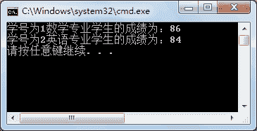

# C# abstract：声明抽象类或抽象方法

> 原文：[`c.biancheng.net/view/2874.html`](http://c.biancheng.net/view/2874.html)

C# abstract 关键字代表的是抽象的，使用该关键字能修饰类和方法，修饰的方法被称为抽象方法、修饰的类被称为抽象类。

在 C# 语言中抽象方法是一种不带方法体的方法，仅包含方法的定义，语法形式如下。

访问修饰符  abstract  方法返回值类型  方法名(参数列表);

其中，当 abstract 用于修饰方法时，也可以将 abstract 放到访问修饰符的前面。

抽象方法定义后面的“;”符号是必须保留的。需要注意的是，抽象方法必须定义在抽象类中。

在定义抽象类时，若使用 abstract 修饰类，将其放到 class 关键字的前面，语法形式如下。

访问修饰符  abstract class  类名
{
    //类成员
}

其中“abstract”关键字也可以放到访问修饰符的前面。

在抽象类中可以定义抽象方法，也可以定义非抽象方法。

通常抽象类会被其他类继承，并重写其中的抽象方法或者虚方法。

此外，尽管在抽象类中仍然能定义构造器，但抽象类不能实例化，即不能使用如下语句。

new  抽象类的名称();

【实例 1】创建抽象类 ExamResult，并在类中定义数学 (Math)、英语 (English) 成绩的属性，定义抽象方法计算总成绩。

分别定义数学专业和英语专业的学生类继承抽象类 ExamResult，重写计算总成绩的方法并根据科目分数的不同权重计算总成绩。

其中，数学专业的数学分数占 60%、英语分数占 40%；英语专业的数学分数占 40%、英语分数占 60%。

根据题目要求，代码如下。

```

abstract class ExamResult
{
    //学号
    public int Id { get; set; }
    //数学成绩
    public double Math { get; set; }
    //英语成绩
    public double English { get; set; }
    //计算总成绩
    public abstract void Total();
}
class MathMajor : ExamResult
{
    public override void Total()
    {
        double total = Math * 0.6 + English * 0.4;
        Console.WriteLine("学号为" + Id + "数学专业学生的成绩为：" + total);
    }
}
class EnglishMajor : ExamResult
{
    public override void Total()
    {
        double total = Math * 0.4 + English * 0.6;
        Console.WriteLine("学号为" + Id + "英语专业学生的成绩为：" + total);
    }
}
```

在 Main 方法中分别创建 MathMajor 和 EnglishMajor 类的对象，并调用其中的 Total 方法，代码如下。

```

class Program
{
    static void Main(string[] args)
    {
        MathMajor mathMajor = new MathMajor();
        mathMajor.Id = 1;
        mathMajor.English = 80;
        mathMajor.Math = 90;
        mathMajor.Total();
        EnglishMajor englishMajor = new EnglishMajor();
        englishMajor.Id = 2;
        englishMajor.English = 80;
        englishMajor.Math = 90;
        englishMajor.Total();
    }
}
```

执行上面的语句，代码如下图所示。


在实际应用中，子类仅能重写父类中的虚方法或者抽象方法，当不需要使用父类中方法的内容时，将其定义成抽象方法，否则将方法定义成虚方法。