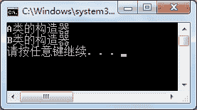
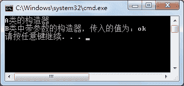
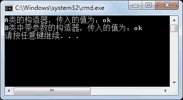

# C#继承关系中构造器之间的关系

> 原文：[`c.biancheng.net/view/2876.html`](http://c.biancheng.net/view/2876.html)

在前面《C#继承》一节中已经介绍了类的继承关系，但一直没有涉及的内容是类中的构造器，在继承关系中构造器之间究竟是什么关系呢？

先看一下实例代码，然后观察运行结果。

```

class Program
{
    static void Main(string[] args)
    {
        B b = new B();
    }
}
class A
{
    public A()
    {
        Console.WriteLine("A 类的构造器");
    }
}
class B :A
{
    public B()
    {
        Console.WriteLine("B 类的构造器");
    }
}
```

执行上面的代码，效果如下图所示。


从上面的执行效果可以看出，在创建子类的实例时，先执行父类 A 中的无参构造器，再执行子类 B 中的无参构造器。

如果调用子类中带参数的构造器会发生什么呢？还会执行父类中的构造器吗？

将上面实例中子类 B 的代码以及 Main 方法的代码更改为如下代码。

```

class Program
{
    static void Main(string[] args)
    {
        B b = new B("ok");
    }
}
class A
{
    public A()
    {
        Console.WriteLine("A 类的构造器");
    }
}
class B :A
{
    public B()
    {
        Console.WriteLine("B 类的构造器");
    }
    public B(string name)
    {
        Console.WriteLine("B 类中带参数的构造器，传入的值为：" + name);
    }
}
```

执行上面的代码，效果如下图所示。


从上面的执行效果可以看出，尽管在子类中调用了带参数的构造器，也会先调用其父类中的无参构造器。

如果需要在子类中调用父类的构造器应该怎么办呢？直接在构造器后面使用“:base(参数)”的形式即可。

默认情况下，在子类的构造器中都会自动调用父类的无参构造器，如果需要调用父类中带参数的构造器才使用“:base(参数)”的形式。

在父类 A 中添加一个带参数的构造器，代码如下。

```

class A
{
    public A()
    {
        Console.WriteLine("A 类的构造器");
    }
    public A(string name)
    {
        Console.WriteLine("A 类的构造器，传入的值为：" + name);
    }
}
class B :A
{
    public B()
    {
        Console.WriteLine("B 类的构造器");
    }
    public B(string name):base(name)    //调用父类中带参数的构造器
    {
        Console.WriteLine("B 类中带参数的构造器，传入的值为：" + name);
    }
}
```

Main 方法中的内容不变，执行效果如下图所示。


从上面的执行效果可以看出，通过在子类的构造器中使用“:base(参数)”的方式即可调用父类带参数的构造器，实际上这也是子类和父类中构造器的一种继承关系表示。

> 注意：如果在父类中没有无参构造器，必须在子类的构造器中继承父类的构造器，否则程序无法成功编译。