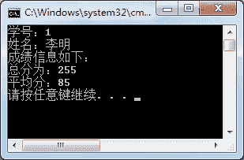

# C#实现接口的两种方式：显示实现和隐式实现接口

> 原文：[`c.biancheng.net/view/2880.html`](http://c.biancheng.net/view/2880.html)

接口的实现实际上和类之间的继承是一样的，也是重写了接口中的方法，让其有了具体的实现内容。

但需要注意的是，在类中实现一个接口时必须将接口中的所有成员都实现，否则该类必须声明为抽象类，并将接口中未实现的成员以抽象方式实现。

在 C# 语言中实现接口的具体语法形式如下。

class  类名 : 接口名
{
    //类中的成员以及实现接口中的成员
}

以抽象方式实现接口中的成员是指将接口中未实现的成员定义为抽象成员，示例代码如下。

```

interface ITest
{
    string name { get; set}
    void Print();
}
abstract class Test : ITest
{
    public abstract string name { get; set; }
    public abstract void Print();
}
```

从上面的代码可以看出，在实现类 Test 中将未实现的属性和方法分别定义为抽象属性和抽象方法，并将实现类定义为抽象类。

这是一种特殊的实现方式，在实际应用中通常是将接口中的所有成员全部实现。

在实现接口的成员时有两种方式，一种是隐式实现接口成员，一种是显式实现接口成员。

在实际应用中隐式实现接口的方式比较常用，由于在接口中定义的成员默认是 public 类型的，隐式实现接口成员是将接口的所有成员以 public 访问修饰符修饰。

显式实现接口是指在实现接口时所实现的成员名称前含有接口名称作为前缀。

需要注意的是使用显式实现接口的成员不能再使用修饰符修饰，即 public、abstract、virtual、 override 等。

接下来将通过实例来演示在编程中隐式实现接口与显式实现接口有什么区别。

【实例】将上一节《C#接口定义》中定义的接口分别使用隐式和显式方式实现。

根据题目要求，首先使用隐式方式来实现接口 ICompute 的成员，以计算机专业的学生类 (ComputerMajor) 实现 ICompute 接口，为其添加英语 (English)、编程 (Programming)、数据库 (Database) 学科成绩属性，代码如下。

```

class ComputerMajor : ICompute
{
    public int Id { get; set; }     //隐式的实现接口中的属性
    public string Name { get; set; }    //隐式实现接口中的属性
    public double English { get; set; }
    public double Programming { get; set; }
    public double Database { get; set; }
    public void Avg()       //隐式实现接口中的方法
    {
        double avg = (English + Programming + Database) / 3;
        Console.WriteLine("平均分：" + avg);
    }
    public void Total()
    {
        double sum = English + Programming + Database;
        Console.WriteLine("总分为：" + sum);
    }
}
```

从上面的代码可以看出，所有接口中的成员在实现类 ComputerMajor 中都被 public 修饰符修饰。

在 Main 方法中调用该实现类的成员，代码如下。

```

class Program
{
    static void Main(string[] args)
    {
        ComputerMajor computerMajor = new ComputerMajor();
        computerMajor.Id = 1;
        computerMajor.Name = "李明";
        computerMajor.English = 80;
        computerMajor.Programming = 90;
        computerMajor.Database = 85;
        Console.WriteLine("学号：" + computerMajor.Id);
        Console.WriteLine("姓名：" + computerMajor.Name);
        Console.WriteLine("成绩信息如下：");
        computerMajor.Total();
        computerMajor.Avg();
    }
}
```

执行上面的代码，效果如下图所示。


使用显式方式来实现接口成员的代码如下。

```

class ComputerMajor : ICompute
{
    public double English { get; set; }
    public double Programming { get; set; }
    public double Database { get; set; }
    int ICompute.Id { get; set; }           //显示实现接口中的属性
    string ICompute.Name { get; set; }      //显示实现接口中的属性
    void ICompute.Total()                   //显示实现接口中的方法
    {
        double sum = English + Programming + Database;
        Console.WriteLine("总分数：" + sum);
    }
    void ICompute.Avg()
    {
        double avg = (English + Programming + Database) / 3;
        Console.WriteLine("平均分为：" + avg);
    }
}
```

从上面的代码可以看出，在使用显式方式实现接口中的成员时，所有成员都会加上接口名称 ICompute 作为前缀，并且不加任何修饰符。

在 Main 方法中调用实现类中的成员,代码如下

```

class Program
{
    static void Main(string[] args)
    {
        ComputerMajor computerMajor = new ComputerMajor();
        ICompute compute = computerMajor;       //创建接口的实例
        compute.Id = 1;
        compute.Name = "李明";
        computerMajor.English = 80;
        computerMajor.Programming = 90;
        computerMajor.Database = 85;
        Console.WriteLine("学号：" + compute.Id);
        Console.WriteLine("姓名：" + compute.Name);
        Console.WriteLine("成绩信息如下：");
        compute.Total();
        compute.Avg();
    }
}
```

执行上面的代码，效果与上图一致。从调用的代码可以看出，在调用显式方式实现接口的成员时，必须使用接口的实例来调用，而不能使用实现类的实例来调用。

与类之间的继承类似，实现类的实例也可以隐式转换为其所实现接口的接口类型。

接口与抽象类的区别入下表所示。

| 接口 | 抽象类 |
| 在接口中仅能定义成员，但不能有具体的实现。 | 抽象类除了抽象成员以外，其他成员允许有具体的实现。 |
| 在接口中不能声明字段，并且不能声明任何私有成员，成员不能包含任何修饰符。 | 在抽象类中能声明任意成员，并能使用任何修饰符来修饰。 |
| 接口能使用类或者结构体来继承。 | 抽象类仅能使用类继承。 |
| 在使用类来实现接口时，必须隐式或显式地实现接口中的所有成员，否则需要将实现类定义为抽象类，并将接口中未实现的成员以抽象的方式实现。 | 在使用类来继承抽象 类时允许实现全部或部分成员，但仅实现其中的部分成员，其实现类必须也定义为抽象类。 |
| 一个接口允许继承多个接口。 | 一个类只能有一个父类。 |