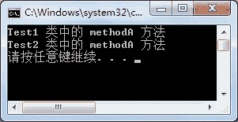
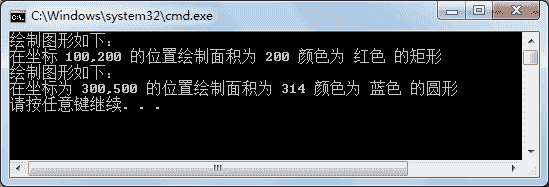

# C#接口中多态的实现

> 原文：[`c.biancheng.net/view/2882.html`](http://c.biancheng.net/view/2882.html)

在前面学过多态能使用类之间的继承关系来实现，通过多个类继承同一个接口，并实现接口中的成员也能完成多态的表示。

使用接口实现多态 需要满足以下两个条件。

*   定义接口并使用类实现了接口中的成员。
*   创建接口的实例指向不同的实现类对象。

假设接口名称为 ITest，分别定义两个实现类来实现接口的成员，示例代码如下。

```

interface ITest
{
    void methodA();
}
class Test1 : ITest
{
    public void methodA()
    {
        Console.WriteLine("Test1 类中的 methodA 方法");
    }
}
class Test2 : ITest
{
    public void methodA()
    {
        Console.WriteLine("Test2 类中的 methodA 方法");
    }
}
```

使用多态的方式调用实现类中的方法，Main 方法中的代码如下。

```

class Program
{
    static void Main(string[] args)
    {
        ITest test1 = new Test1();  //创建接口的实例 test1 指向实现类 Test1 的对象
        test1.methodA();
        ITest test2 = new Test2();  //创建接口的实例 test2 指向实现类 Test2 的对象
        test2.methodA();
    }
}
```

执行上面的代码，效果如下图所示。


从上面的执行效果可以看出，使用不同类实现同一接口的方法输出的内容各不相同，这就是使用接口的方式实现多态的方法。

【实例】创建绘制图形的接口，分别使用两个类来实现接口绘制不同的图形。

根据题目要求，在绘制图形的接口中包括图形面积、坐标、颜色属性，并编写一个方法输出图形的描述，即属性值。接口定义的代码如下。

```

interface IShape
{
    double Area { get; }
    double X { get; set; }
    double Y { get; set; }
    string Color { get; set; }
    void Draw();
}
```

下面分别使用矩形类 (Rectangle) 和圆类 (Circle) 实现该接口，并实现接口中的所有成员，代码如下。

```

class Rectangle :IShape
{
    //为矩形的长和宽赋值
    public Rectangle(double length,double width)
    {
        this.Length = length;
        this.Width = width;
    }
    public double Length { get; set; }//定义长方形的长度
    public double Width { get; set; }//定义长方形的宽度
    public double Area
    {
        get
        {
            return Length * Width;//计算长方形面积
        }
    }
    public string Color { get; set; }
    public double X { get; set; }
    public double Y { get; set; }
    public void Draw()
    {
        Console.WriteLine("绘制图形如下：");
        Console.WriteLine("在坐标 {0},{1} 的位置绘制面积为 {2} 颜色为 {3} 的矩形", X, Y, Area, Color);
    }
}
class Circle : IShape
{
    //为圆的半径赋值
    public Circle(double radius)
    {
        this.Radius = radius;
    }
    public double Radius { get; set; }
    public double Area
    {
        get
        {
            return Radius * Radius * 3.14;
        }
    }
    public string Color { get; set; }
    public double X { get; set; }
    public double Y { get; set; }
    public void Draw()
    {
        Console.WriteLine("绘制图形如下：");
        Console.WriteLine("在坐标为 {0},{1} 的位置绘制面积为 {2} 颜色为 {3} 的圆形", X, Y, Area, Color);
    }
}
```

在 Main 方法中分别调用实现类中的属性和方法，代码如下。

```

class Program
{
    static void Main(string[] args)
    {
        IShape shape1 = new Rectangle(10, 20);
        shape1.X = 100;
        shape1.Y = 200;
        shape1.Color = "红色";
        shape1.Draw();
        IShape shape2 = new Circle(10);
        shape2.X = 300;
        shape2.Y = 500;
        shape2.Color = "蓝色";
        shape2.Draw();
    }
}
```

执行上面的代码，效果如下图所示。


在该实例中，接口的每个实现类中都设置了带参数的构造方法为实现类中新增加的属性赋值，这样在创建实现类的实例时即可为相应的属性赋值。

如果不使用构造方法为实现类中新增加的属性赋值，则需要先创建实现类的实例，并对其新增加的属性赋值，再将实现类的实例赋给接口的实例。

与 "IShape shapel = newRectangle( 10,20);" 等效的代码如下。

```

Reatangle rectangle = new Rectangle();
rectangle.Length = 10;
rectangle.Width = 20;
IShape shape1 = rectangle;
```

为了简化代码，在接口的实现类中定义了新的属性，通常是通过实现类的构造方法为属性赋值的。