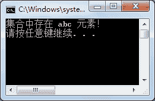
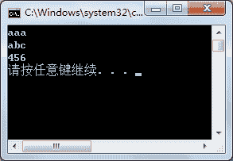
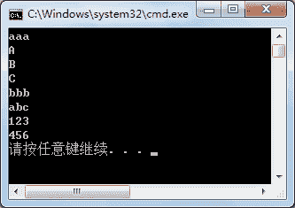
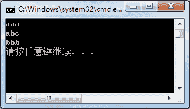
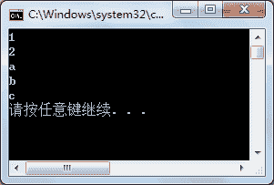

# C# ArrayList 类：动态数组

> 原文：[`c.biancheng.net/view/2892.html`](http://c.biancheng.net/view/2892.html)

C# ArrayList 类（动态数组）是一个最常用的集合类，与数组的操作方法也是最类似的。

ArrayList 代表了可被单独索引的对象的有序集合。它基本上可以替代一个数组。

但是，与数组不同的是，ArrayList 可以使用索引在指定的位置添加和移除项目，动态数组会自动重新调整它的大小。

同时 ArrayList 也允许在列表中进行动态内存分配、增加、搜索、排序各项。

创建 ArrayList 类的对象需要使用该类的构造方法，如下表所示。

| 构造方法 | 作用 |
| ArrayList() | 创建 ArrayList 的实例，集合的容量是默认初始容量 |
| ArrayList(ICollection c) | 创建 ArrayList 的实例，该实例包含从指定实例中复制的元素，并且初始容量与复制的元素个数相同 |
| ArrayList(int capacity) | 创建 ArrayList 的实例，并设置其初始容量 |

下面分别使用 ArrayList 类的构造器创建 ArrayList 实例，代码如下。

```

ArrayList listl=new ArrayList();
ArrayList list2=new ArrayList(listl);
ArrayList list3=new ArrayList(20);
```

在创建 ArrayList 类的实例后，集合中还未存放值。

在 C# 语言中提供了集合初始化器，允许在创建集合实例时向集合中添加元素，代码如下。

```

ArrayList list4 = new ArrayList(){l,2,3,4};
```

在`{}`中的值即集合中存入的值。

集合与数组一样也能使用 foreach 语句遍历元素。

由于在集合中存放的值允许是任意类型，能使用 var 关键字来定义任意类型的变量。

遍历 list4 集合中的数据的代码如下。

```

foreach(var v in list4)
{
    Console.WriteLine(v);
}
```

执行上面的代码，即可将集合 list4 中的元素输岀。

在 ArrayList 类中提供了很多属性和方法供开发人员调用，以便简化更多的操作。

ArrayList 类中常用的属性和方法如下表所示。

| 属性或方法 | 作用 |
| int Add(object value) | 向集合中添加 object 类型的元素，返回元素在集合中的下标 |
| void AddRange(ICollection c) | 向集合中添加另一个集合 c |
| Capacity | 属性，用于获取或设置集合中可以包含的元素个数 |
| void Clear()  | 从集合中移除所有元素 |
| bool Contains(object item) | 判断集合中是否含有 item 元素，若含有该元素则返回 True, 否则返回 False |
| void CopyTo(Array array) | 从目标数组 array 的第 0 个位置开始，将整个集合中的元素复制到类型兼容的数组 array 中 |
| void CopyTo(Array array,int arraylndex) | 从目标数组 array 的指定索引 arraylndex 处，将整个集合中的元素赋值到类型兼容的数组 array 中 |
| void CopyTo(int index,Array array,int arrayIndex,int count) | 从目标数组 array 的指定索引 arrayindex 处，将集合中从指定索引 index 开始的 count 个元素复制到类型兼容的数组 array 中 |
| Count | 属性，用于获取集合中实际含有的元素个数 |
| int IndexOf(object value) | 返回 value 值在集合中第一次出现的位置 |
| int IndexOf(object value,int startIndex) | 返回 value 值在集合的 startindex 位置开始第一次出现的位置 |
| int IndexOf(object value,int startIndex,int count) | 返回 value 值在集合的 startindex 位置开始 count 个元素中第一次出现的位置 |
| int LastIndexOf(object value)  | 返回 value 值在集合中最后一次出现的位置 |
| int LastIndexOf(object value,int startIndex) | 返回 value 值在集合的 startindex 位置开始最后一次出现的位置 |
| int LastIndexOf(object value,int startIndex,int count) | 入元素 value 值在集合的 startindex 位置开始 count 个元素中最后一次出现的位置 |
| void Insert(int index,object value) | 返回 value 向集合中的指定索引 index 处插 |
| void InsertRange(int index,ICollection c)  | 向集合中的指定索引 index 处插入一个集合 |
| void Remove(object obj) | 将指定兀素 obj 从集合中移除 |
| void RemoveAt(int index) | 移除集合中指定位置 index 处的元素 |
| void RemoveRange(int index,int count) | 移除集合中从指定位置 index 处的 count 个元素 |
| void Reverse()  | 将集合中的元素顺序反转 |
| void Reverse(int index,int count) | 将集合中从指定位置 index 处的 count 个元素反转 |
| void Sort() | 将集合中的元素排序，默认从小到大排序 |
| void Sort(IComparer comparer)  | 将集合中的元素按照比较器 comparer 的方式排序 |
| void Sort(int index,int count,IComparer comparer) | 将集合中的元素从指定位置 index 处的 count 个元素按照比较器 comparer 的方式排序 |
| void TrimToSize() | 将集合的大小设置为集合中元素的实际个数 |

下面通过实例来演示 ArrayList 类中属性和方法的使用。

定义 ArrayList 集合，在集合中存入任意值，完成如下操作。

*   查找集合中是否含有 abc 元素。
*   将集合中元素下标是偶数的元素添加到另一个集合中。
*   在集合中第一个元素的后面任意插入 3 个元素。
*   将集合中的元素使用 Sort 方法排序后输出。

【实例 1】是查找集合中的元素，使用 IndexOf 或者 LastlndexOf 都可以，代码如下。

```

class Program
{
    static void Main(string[] args)
    {
        ArrayList list = new ArrayList() { "aaa", "bbb", "abc", 123, 456 };
        int index = list.IndexOf("abc");
        if (index != -1)
        {
            Console.WriteLine("集合中存在 abc 元素！");
        }
        else
        {
            Console.WriteLine("集合中不存在 abc 元素！");
        }
    }
}
```

执行上面的代码，效果如下图所示。


【实例 2】将集合中下标为偶数的元素添加到另一个集合中，由于集合中共有 5 个元素，则所添加元素的下标分别为 0、2、4。

向集合中添加元素使用 Add 方法即可，代码如下。

```

class Program
{
    static void Main(string[] args)
    {
        ArrayList list = new ArrayList() { "aaa", "bbb", "abc", 123, 456 };
        ArrayList newList = new ArrayList();
        for(int i = 0; i < list.Count; i = i + 2)
        {
            newList.Add(list[i]);
        }
        foreach(var v in newList)
        {
            Console.WriteLine(v);
        }
    }
}
```

执行上面的代码，效果如下图所示。


从上面的执行效果可以看出，newList 集合中的元素是 list 集合中下标为偶数的元素。

【实例 3】在集合中的第一个元素后面添加元素，使用 Insert 方法每次只能添加一个元素，但使用 InsertRange 方法能直接将一个集合插入到另一个集合中。

在本例中使用的是 InsertRange 方法，代码如下。

```

class Program
{
    static void Main(string[] args)
    {
        ArrayList list = new ArrayList() { "aaa", "bbb", "abc", 123, 456 };
        ArrayList insertList = new ArrayList() { "A", "B", "C" };
        list.InsertRange(1, insertList);
        foreach(var v in list)
        {
            Console.WriteLine(v);
        }
    }
}
```

执行上面的代码，效果如下图所示。


从上面的执行效果可以看出，已经在原有集合 list 中的第一个元素后面加入了 3 个元素。

【实例 4】将集合中的元素使用 Sort 方法排序后输出。

如果使用 Sort 方法对集合中的元素排序，则需要将集合中的元素转换为同一类型才能比较，否则会出现无法比较的异常。

这里创建一个 ArrayList，并在其中存入字符串类型的值，再使用 Sort 方法排序，代码如下。

```

class Program
{
    static void Main(string[] args)
    {
        ArrayList list = new ArrayList() { "aaa", "bbb", "abc" };
        list.Sort();
        foreach(var v in list)
        {
            Console.WriteLine(v);
        }
    }
}
```

执行上面的代码，效果如下图所示。


从上面的执行效果可以看出，Sort 方法将集合中的元素按照字母的 ASCII 码从小到大排序，相当于字母的顺序。

如果需要将所得到的值按照从大到小的顺序排序，则可以在使用过 Sort 方法后再使用 Reverse 方法将元素倒置。

字符串类型的值不能直接使用大于、小于的方式比较，要使用字符串的 CompareTo 方法，该方法的返回值是 int 类型，语法形式如下。

字符串 1.CompareTo(字符串 2);

当字符串 1 与字符串 2 相等时结果为 0；

当字符串 1 的字符顺序在字符串 2 前面时结果为 -1;

当字符串 1 的字符顺序在字符串 2 后面时结果为 1。

在由多个字符组成的字符串中，首先比较的是两个字符串的首字母，如果相同则比较第二个字符，依此类推，如果两个字符串的首字母不同，则不再比较后面的字符。

在 ArrayList 类中常用的属性和方法表中列出的 Sort 方法中，Sort 方法能传递 IComparer 类型的参数。

IComparer 类型的参数是自定义的比较器，要求使用一个类来实现 IComparer 接口，并实现其中的 Compare 方法。

下面通过实例来完成用自定义比较器实现排序的操作。

【实例 5】定义一个 ArrayList 类型的集合，并在其中任意存放 5 个值，使用 Sort 方法完成排序并输岀结果。

根据题目要求，由于没有在集合中指定统一的数据类型，需要用自定义比较器来完成排序，自定义比较器类 MyCompare，代码如下。

```

class MyCompare :IComparer
{
    public int Compare(object x,object y)
    {
        string str1 = x.ToString();
        string str2 = y.ToString();
        return str1.CompareTo(str2);
    }
}
```

在上面的代码中，对于 Compare 方法，当比较的两个值 x 和 y 相等时返回 0,当 x>y 时返回值大于 0,当 x<y 时返回值小于 0。

由于 CompareTo 方法的返回值与 Compare 方法的返回值的计算方法相同，因此，直接返回 CompareTo 的比较结果即可满足对两个值从小到大的比较操作。

如果需要返回的是从大到小的比较结果，则只需要将比较的两个值调换顺序即可，即“return str2.CompareTo(strl);”。

在 ArrayList 集合中使用带自定义比较器的 Sort 方法，代码如下。

```

class Program
{
    static void Main(string[] args)
    {
        ArrayList list = new ArrayList() { "a", "b", "c", 1, 2 };
        MyCompare myCompare = new MyCompare();//创建自定义比较器实例
        list.Sort(myCompare);
        foreach(var v in list)
        {
            Console.WriteLine(v);
        }
    }
}
```

执行上面的代码，效果如下图所示。


从上面的执行效果可以看出，虽然在 ArrayList 集合中存放了不同类型的值，但通过在自定义比较器中将所有的值转换为字符串类型并进行比较，使用 Sort 方法即可完成排序操作。