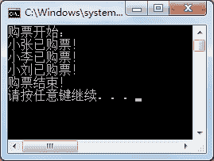

# C# Queue 类：队列

> 原文：[`c.biancheng.net/view/2894.html`](http://c.biancheng.net/view/2894.html)

C# Queue (队列) 是常见的数据结构之一，队列是一种先进先出的结构，即元素从队列尾部插入，从队列的头部移除，类似于日常生活中的站队，先到先得的效果。

集合中的 Queue 类模拟了队列操作，提供了队列中常用的属性和方法。

Queue 类提供了 4 个构造方法，如下表所示。

| 构造方法 | 作用 |
| Queue() | 创建 Queue 的实例，集合的容量是默认初始容量 32 个元素，使用默认的增长因子 |
| Queue(ICollection col) | 创建 Queue 的实例，该实例包含从指定实例中复制的元素，并且初始容量与复制的元素个数、增长因子相同 |
| Queue(int capacity)  | 创建 Queue 的实例，并设置其指定的元素个数，默认增长因子 |
| Queue(int capacity, float growFactor) | 创建 Queue 的实例，并设置其指定的元素个数和增长因子 |

增长因子是指当需要扩大容量时，以当前的容量（capacity）值乘以增长因子（growFactor）的值来自动增加容量。

下面使用上表中的构造方法来创建 Queue 的实例，代码如下。

```

//第 1 中构造器
Queue queueq1 = new Queue();
//第 2 中构造器
Queue queueq2 = new Queue(queue1);
//第 3 中构造器
Queue queueq3 = new Queue(30);
//第 4 中构造器
Queue queueq4 = new Queue(30, 2);
```

与上一节《C# ArrayList》中介绍的 ArrayList 类不同，Queue 类不能在创建实例时直接添加值。

Queue 类中常用的属性和方法如下表所示。

| 属性或方法 | 作用 |
| Count | 属性，获取 Queue 实例中包含的元素个数 |
| void Clear()  | 清除 Queue 实例中的元素 |
| bool Contains(object obj) | 判断 Queue 实例中是否含有 obj 元素 |
| void CopyTo(Array array, int index)  | 将 array 数组从指定索引处的元素开始复制到 Queue 实例中 |
| object Dequeue() | 移除并返回位于 Queue 实例开始处的对象 |
| void Enqueue(object obj) | 将对象添加到 Queue 实例的结尾处 |
| object Peek()  | 返回位于 Queue 实例开始处的对象但不将其移除 |
| object[] ToArray() | 将 Queue 实例中的元素复制到新数组 |
| void TrimToSize()  | 将容量设置为 Queue 实例中元素的实际数目 |
| IEnumerator GetEnumerator() |  返回循环访问 Queue 实例的枚举数 |

下面通过实例来演示 Queue 类的使用。

【实例 1】创建 Queue 类的实例，模拟排队购电影票的操作。

根据题目要求，先向队列中加入 3 个元素，然后再依次购票。实现代码如下。

```

class Program
{
    static void Main(string[] args)
    {
        Queue queue = new Queue();
        //向队列中加入 3 为购票人
        queue.Enqueue("小张");
        queue.Enqueue("小李");
        queue.Enqueue("小刘");
        Console.WriteLine("购票开始：");
        //当队列中没有人时购票结束
        while (queue.Count != 0)
        {
            Console.WriteLine(queue.Dequeue() + "已购票！");
        }
        Console.WriteLine("购票结束！");
    }
}
```

执行上面的代码，效果如下图所示。


从上面的执行效果可以看出，在从队列中取值时与存入队列中的值顺序是相同的。

【实例 2】向 Queue 类的实例中添加 3 个值，在不移除队列中元素的前提下将队列中的元素依次输出。

根据题目要求，可以使用 ToArray() 方法将 Queue 类的实例中存放的值复制到数组后再遍历数组。实现的代码如下。

```

class Program
{
    static void Main(string[] args)
    {
        Queue queue = new Queue();
        queue.Enqueue("aaa");
        queue.Enqueue("bbb");
        queue.Enqueue("ccc");
        object[] obj = queue.ToArray();
        foreach(var v in obj)
        {
            Console.WriteLine(v);
        }
    }
}
```

执行上面的代码，效果如下图所示。


除了使用 ToArray() 方法以外，还可以使用 GetEnumerator() 方法来遍历，实现的代码如下。

```

class Program
{
    static void Main(string[] args)
    {
        Queue queue = new Queue();
        queue.Enqueue("aaa");
        queue.Enqueue("bbb");
        queue.Enqueue("ccc");
        IEnumerator enumerator = queue.GetEnumerator();
        while (enumerator.MoveNext())
        {
            Console.WriteLine(enumerator.Current);
        }
    }
}
```

执行上面的代码，效果与使用 ToArray() 所示的效果相同。在实际应用中，我们可以自由选择上面两种方法。