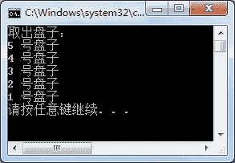

# C# Stack 类：堆栈

> 原文：[`c.biancheng.net/view/2895.html`](http://c.biancheng.net/view/2895.html)

C# Stack (栈)是常见的数据结构之一，栈是一种先进后出的结构，即元素从栈的尾部插入，从栈的尾部移除，类似于日常生活中搬家的时候装车，先装上车的东西要后拿下来。

集合中的 Stack 类模拟了栈操作，提供了栈中常用的属性和方法。

Stack 类提供了 3 种构造方法，如下表所示。

| 构造方法 | 作用 |
| Stack() | 使用初始容量创建 Stack 的对象 |
| Stack(ICollection col)  | 创建 Stack 的实例，该实例包含从指定实例中复制的元素，并且初始容量与复制的元素个数、增长因子相同 |
| Stack(int capacity) | 创建 Stack 的实例，并设置其初始容量 |

Stack 类中的常用属性和方法如下表所示。

| 属性或方法 | 作用 |
| Push(object obj) | 向栈中添加元素，也称入栈 |
| object Peek() | 用于获取栈顶元素的值，但不移除栈顶元素的值 |
| object Pop() | 用于移除栈顶元素的值，并移除栈顶元素 |
| Clear() | 从 Stack 中移除所有的元素 |
| Contains(object obj) | 判断某个元素是否在 Stack 中 |
| object[] ToArray() | 复制 Stack 到一个新的数组中 |

下面通过实例来演示 Stack 类的使用。

【实例】创建一个栈（Stack），模拟餐馆盘子的存取。

根据题目要求，先在栈中按顺序放置 5 个盘子，再将所有盘子取出，取盘子时应先取最上面的盘子，与栈的存取原理一致。具体的代码如下。

```

class Program
{
    static void Main(string[] args)
    {
        Stack stack = new Stack();
        //向栈中存放元素
        stack.Push("1 号盘子");
        stack.Push("2 号盘子");
        stack.Push("3 号盘子");
        stack.Push("4 号盘子");
        stack.Push("5 号盘子");
        Console.WriteLine("取出盘子：");
        //判断栈中是否有元素
        while(stack.Count != 0)
        {
            //取出栈中的元素
            Console.WriteLine(stack.Pop());
        }
    }
}
```

执行上面的代码，效果如下图所示。


从上面的执行效果可以看出，通过 Stack 类提供的 Pop 方法可以依次从栈顶取出栈中的每一个元素。