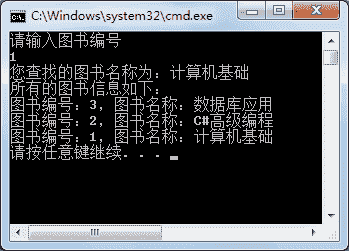

# C# Hashtable 类：哈希表（散列表）

> 原文：[`c.biancheng.net/view/2897.html`](http://c.biancheng.net/view/2897.html)

C# Hashtable 类实现了 IDictionary 接口，集合中的值都是以键值对的形式存取的。

C# 中的 Hashtable 称为哈希表，也称为散列表，在该集合中使用键值对（key/value）的形式存放值。

换句话说，在 Hashtable 中存放了两个数组，一个数组用于存放 key 值，一个数组用于存放 value 值。

此外，还提供了根据集合中元素的 key 值查找其对应的 value 值的方法。

Hashtable 类提供的构造方法有很多，最常用的是不含参数的构造方法，即通过如下代码来实例化 Hashtable 类。

Hashtable 对象名 = new Hashtable ();

Hashtable 类中常用的属性和方法如下表所示。

| 属性或方法 | 作用 |
| Count | 集合中存放的元素的实际个数 |
| void Add(object key,object value) | 向集合中添加元素 |
| void Remove(object key) | 根据指定的 key 值移除对应的集合元素 |
| void Clear() | 清空集合 |
| ContainsKey (object key) | 判断集合中是否包含指定 key 值的元素 |
| ContainsValue(object value) | 判断集合中是否包含指定 value 值的元素 |

下面通过实例演示 Hashtable 类的使用。

【实例】使用 Hashtable 集合实现图书信息的添加、查找以及遍历的操作。

根据题目要求，先向 Hashtable 集合中添加 3 个值，再根据所输入的 key 值查找图书名称，最后遍历所有的图书信息，代码如下。

```

class Program
{
    static void Main(string[] args)
    {
        Hashtable ht = new Hashtable();
        ht.Add(1, "计算机基础");
        ht.Add(2, "C#高级编程");
        ht.Add(3, "数据库应用");
        Console.WriteLine("请输入图书编号");
        int id = int.Parse(Console.ReadLine());
        bool flag = ht.ContainsKey(id);
        if (flag)
        {
            Console.WriteLine("您查找的图书名称为：{0}", ht[id].ToString());
        }
        else
        {
            Console.WriteLine("您查找的图书编号不存在！");
        }
        Console.WriteLine("所有的图书信息如下：");
        foreach(DictionaryEntry d in ht)
        {
            int key = (int)d.Key;
            string value = d.Value.ToString();
            Console.WriteLine("图书编号：{0}，图书名称：{1}", key, value);
        }
    }
}
```

执行上面的代码，效果如下图所示。


从上面的执行效果可以看出，在使用 Hashtable 时能同时存放 key/value 的键值对，由于 key 值是唯一的，因此可以根据指定的 key 值查找 value 值。