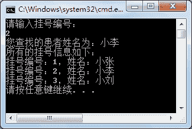

# C# SortedList 类：有序列表

> 原文：[`c.biancheng.net/view/2900.html`](http://c.biancheng.net/view/2900.html)

C# SortedList 类实现了 IDictionary 接口 ,集合中的值都是以键值对的形式存取的。

C# SortedList 称为有序列表，按照 key 值对集合中的元素排序。

SortedList 集合中所使用的属性和方法与上一节《C# Hashtable》中介绍的 Hashtable 比较类似，这里不再赘述。

下面通过实例来演示 SortedList 集合的使用。

【实例】使用 SortedList 实现挂号信息的添加、查找以及遍历操作。

根据题目要求，向 SortedList 集合中添加 3 位挂号信息（挂号编号、姓名），并根据患者编号查找患者姓名，遍历所有的挂号信息。具体的代码如下。

```

class Program
{
    static void Main(string[] args)
    {
        SortedList sortList = new SortedList();
        sortList.Add(1, "小张");
        sortList.Add(2, "小李");
        sortList.Add(3, "小刘");
        Console.WriteLine("请输入挂号编号：");
        int id = int.Parse(Console.ReadLine());
        bool flag = sortList.ContainsKey(id);
        if (flag)
        {
            string name = sortList[id].ToString();
            Console.WriteLine("您查找的患者姓名为：{0}", name);
        }
        else
        {
            Console.WriteLine("您查找的挂号编号不存在！");
        }
        Console.WriteLine("所有的挂号信息如下：");
        foreach(DictionaryEntry d in sortList)
        {
            int key = (int)d.Key;
            string value = d.Value.ToString();
            Console.WriteLine("挂号编号：{0}，姓名：{1}", key, value);
        }
    }
}
```

执行上面的代码，效果如下图所示。


从上面的执行效果可以看出，SortedList 集合中的元素是按 key 值的顺序排序的。