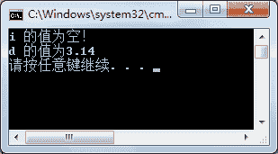

# C#可空类型：Nullable

> 原文：[`c.biancheng.net/view/2903.html`](http://c.biancheng.net/view/2903.html)

对于引用类型的变量来说，如果未对其赋值，在默认情况下是 Null 值，对于值类型的变量，如果未赋值，整型变量的默认值为 0。

但通过 0 判断该变量是否赋值了是不太准确的。

在 C# 语言中提供了一种泛型类型（即可空类型 (System.Nullable<T>)）来解决值类型的变量在未赋值的情况下允许为 Null 的情况。

定义可空类型变量的语法形式如下。

System.Nullable<T> 变量名;

其中，`Nullable`所在的命名空间 `System` 在 C# 类文件中默认是直接引入的，因此可以省略 `System`，直接使用 `Nullable` 即可；`T` 代表任意类型，例如定义一个存放 int 类型值的变量，代码如下。

```

Nullable<int> a;
```

这样，可以将变量 a 的值设置为 Null。即：

```

Nullable<int> a = Null;
```

除了使用上面的方法定义可空类型变量以外，还可以通过如下语句定义一个 int 类型的可空类型变量。

```

int? a
```

从上面的定义可以看出，`int?` 等同于 `Nullable<int>`。

此外，在使用可空类型时也可以通过 `HasValue` 属性判断变量值是否为 Null 值。

下面通过实例来演示可空类型的应用。

【实例】分别创建一个 int 的可空类型变量和 double 的可空类型变量，并使用 HasValue 属性判断其值是否为空。

根据题目要求，代码如下。

```

class Program
{
    static void Main(string[] args)
    {
        int? i = null;
        double? d = 3.14;
        if (i.HasValue)
        {
            Console.WriteLine("i 的值为{0}", i);
        }
        else
        {
            Console.WriteLine("i 的值为空！");
        }
        if (d.HasValue)
        {
            Console.WriteLine("d 的值为{0}", d);
        }
        else
        {
            Console.WriteLine("d 的值为空！");
        }
    }  
}
```

执行上面的代码，效果如下图所示。


从上面的执行效果可以看出，可空类型允许将值类型变量的值设置为 Null，并可以通过 HasValue 属性判断其是否为 Null 值。