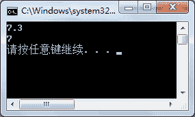

# C#泛型方法的定义及使用

> 原文：[`c.biancheng.net/view/2904.html`](http://c.biancheng.net/view/2904.html)

在 C# 语言中泛型方法是指通过泛型来约束方法中的参数类型，也可以理解为对数据类型设置了参数。

如果没有泛型，每次方法中的参数类型都是固定的，不能随意更改。

在使用泛型后，方法中的数据类型则有指定的泛型来约束，即可以根据提供的泛型来传递不同类型的参数。

定义泛型方法需要在方法名和参数列表之间加上`<>`，并在其中使用 `T` 来代表参数类型。

当然，也可以使用其他的标识符来代替参数类型， 但通常都使用 `T` 来表示。下面通过实例来演示泛型方法的使用。

【实例】创建泛型方法，实现对两个数的求和运算。

根据题目要求，代码如下。

```

class Program
{
    static void Main(string[] args)
    {
        //将 T 设置为 double 类型
        Add<double>(3.3, 4);
        //将 T 设置为 int 类型
        Add<int>(3, 4);
    }
    //加法运算
    private static void Add<T>(T a, T b)
    {
        double sum = double.Parse(a.ToString()) + double.Parse(b.ToString());
        Console.WriteLine(sum);
    }
}
```

执行上面的代码，效果如下图所示。


从上面的执行效果可以看出，在调用 Add 方法时能指定不同的参数类型执行加法运算。

如果在调用 Add 方法时，没有按照 <T> 中规定的类型传递参数，则会出现编译错误，这样就可以尽量避免程序在运行时出现异常。