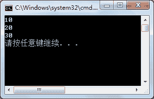

# C#泛型类的定义及使用

> 原文：[`c.biancheng.net/view/2905.html`](http://c.biancheng.net/view/2905.html)

C# 语言中泛型类的定义与泛型方法类似，是在泛型类的名称后面加上<T>，当然,也可以定义多个类型，即“<T1,T2,・・・>”。

具体的定义形式如下。

class 类名<T1,T2,…>
{
    //类的成员
}

这样，在类的成员中即可使用 T1、T2 等类型来定义。

下面通过实例来演示泛型类的使用。

【实例】定义泛型类，并在泛型类中定义数组，提供添加和显示数组中全部元素的 方法。

根据题目要求，代码如下。

```

class MyTest<T>
{
    private T[] items = new T[3];
    private int index = 0;
    //向数组中添加项
    public void Add(T t)
    {
        if (index < 3)
        {
            items[index] = t;
            index++;
        }
        else
        {
            Console.WriteLine("数组已满！");
        }
    }
    //读取数组中的全部项
    public void Show()
    {
        foreach(T t in items)
        {
            Console.WriteLine(t);
        }
    }
}
```

在 Main 方法中调用 MyTest 类中的方法，代码如下。

```

class Program
{
    static void Main(string[] args)
    {
        MyTest<int> test = new MyTest<int>();
        test.Add(10);
        test.Add(20);
        test.Add(30);
        test.Show();
    }
}
```

执行上面的代码，效果如下图所示。


从上面的执行效果可以看出，根据泛型类中指定的数据类型创建数组，并实现了对数组元素的添加和显示。