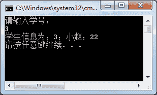

# C#泛型集合定义及使用

> 原文：[`c.biancheng.net/view/2906.html`](http://c.biancheng.net/view/2906.html)

C# 语言中泛型集合是泛型中最常见的应用，主要用于约束集合中存放的元素。

由于在集合中能存放任意类型的值，在取值时经常会遇到数据类型转换异常的情况，因此推荐在定义集合时使用泛型集合。

前面《C# ArrayList》与《C# Hashtable》中已经介绍了非泛型集合中的 ArrayList、Hashtable。

非泛型集合中的 ArrayList、Hashtable 在泛型集合中分别使用 List<T> 和 Dictionary<K,V> 来表示，其他泛型集合均与非泛型集合一致。

下面以 List<T> 和 Dictionary<K,V> 为例介绍泛型集合的使用。

【实例 1】使用泛型集合 List<T> 实现对学生信息的添加和遍历。

根据题目要求，将学生信息定义为一个类，并在该类中定义学号、姓名、年龄属性。

在泛型集合 List<T> 中添加学生信息类的对象，并遍历该集合。实现的代码如下。

```

class Program
{
    static void Main(string[] args)
    {
        //定义泛型集合
        List<Student> list = new List<Student>();
        //向集合中存入 3 名学员
        list.Add(new Student(1, "小明", 20));
        list.Add(new Student(2, "小李", 21));
        list.Add(new Student(3, "小赵", 22));
        //遍历集合中的元素
        foreach(Student stu in list)
        {
            Console.WriteLine(stu);
        }
    }
}
class Student
{
    //提供有参构造方法，为属性赋值
    public Student(int id,string name,int age)
    {
        this.id = id;
        this.name = name;
        this.age = age;
    }
    //学号
    public int id { get; set; }
    //姓名
    public string name { get; set; }
    //年龄
    public int age { get; set; }
    //重写 ToString 方法
    public override string ToString()
    {
        return id + "：" + name + "：" + age;
    }
}
```

执行上面的代码，效果如下图所示。


从上面的执行效果可以看出，在该泛型集合中存放的是 Student 类的对象，当从集合中取岀元素时并不需要将集合中元素的类型转换为 Student 类的类型，而是直接遍历集合中的元素即可，这也是泛型集合的一个特点。

【实例 2】使用泛型集合 Dictionary<K,V> 实现学生信息的添加，并能够按照学号查询学生信息。

根据题目要求，将在实例 1 中所创建学生信息类的对象作为 Dictionary<K,V> 集合中的 value 值部分，key 值部分使用学生信息类中的学号，这样能很容易地通过学号查询学生的信息。实现的代码如下。

```

class Program
{
    static void Main(string[] args)
    {
        Dictionary<int, Student> dictionary = new Dictionary<int, Student>();
        Student stu1 = new Student(1, "小明", 20);
        Student stu2 = new Student(2, "小李", 21);
        Student stu3 = new Student(3, "小赵", 22);
        dictionary.Add(stu1.id, stu1);
        dictionary.Add(stu2.id, stu2);
        dictionary.Add(stu3.id, stu3);
        Console.WriteLine("请输入学号：");
        int id = int.Parse(Console.ReadLine());
        if (dictionary.ContainsKey(id))
        {
            Console.WriteLine("学生信息为：{0}", dictionary[id]);
        }
        else
        {
            Console.WriteLine("您查找的学号不存在！");
        }
    }
}
```

执行上面的代码，效果如下图所示。


从上面的执行效果可以看出，根据输入的学号直接从 Dictionary<int,Student> 泛型集合中查询出所对应的学生信息，并且在输出学生信息时不需要进行类型转换，直接输出其对应的 Student 类的对象值即可。