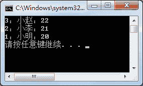

# C# IComparable、IComparer 接口：比较两个对象的值

> 原文：[`c.biancheng.net/view/2911.html`](http://c.biancheng.net/view/2911.html)

在 C# 语言中提供了 IComparer 和 IComparable 接口比较集合中的对象值，主要用于对集合中的元素排序。

IComparer 接口用于在一个单独的类中实现，用于比较任意两个对象。

IComparable 接口用于在要比较的对象的类中实现，可以比较任意两个对象。

在比较器中还提供了泛型接口的表示形式，即 IComparer<T> 和 IComparable<T> 的形式。

对于 IComparer<T> 接口，方法如下表所示。

| 方法 | 作用 |
| CompareTo(T obj) | 比较两个对象值 |

如果需要对集合中的元素排序，通常使用 CompareTo 方法实现，下面通过实例来演示 CompareTo 方法的使用。

【实例 1】在上一节《C#泛型集合》中实例 1 的基础上将学生信息按照年龄从大到小输出。

根据题目要求，如果不使用比较器，由于集合中的元素是 Student 类型的，不能直接排序，需要按照 Student 学生信息类中的年龄属性排序，因此代码比较烦琐。

使用 CompareTo 方法实现比较简单。在 Student 类中添加 CompareTo 方法，代码如下。

```

class Student:IComparable<Student>
{
    //提供有参构造方法，为属性赋值
    public Student(int id,string name,int age)
    {
        this.id = id;
        this.name = name;
        this.age = age;
    }
    //学号
    public int id { get; set; }
    //姓名
    public string name { get; set; }
    //年龄
    public int age { get; set; }
    //重写 ToString 方法
    public override string ToString()
    {
        return id + "：" + name + "：" + age;
    }
    //定义比较方法，按照学生的年龄比较
    public int CompareTo(Student other)
    {
        if (this.age > other.age)
        {
            return -1;
        }
        return 1;
    }
}
```

在 Main 方法中创建泛型集合，并向集合中添加项以及进行排序的代码如下。

```

class Program
{
    static void Main(string[] args)
    {
        List<Student> list = new List<Student>();
        list.Add(new Student(1, "小明", 20));
        list.Add(new Student(2, "小李", 21));
        list.Add(new Student(3, "小赵", 22));
        list.Sort();
        foreach(Student stu in list)
        {
            Console.WriteLine(stu);
        }
    }
}
```

执行上面的代码，效果如下图所示。


从上面的执行效果可以看出，在使用集合的 Sort 方法后，集合中的元素是按照学生年龄从大到小的顺序输出的。

在默认情况下，Sort 方法是将集合中的元素从小到大输出的， 由于在 Student 类中重写了 CompareTo 方法，因此会按照预先定义好的排序规则对学生信息排序。

需要说明的是，在 CompareTo 方法中返回值大于 0 则表示第一个对象的值大于第二个对象的值，返回值小于 0 则表示第一个对象的值小于第二个对象的值，返回值等于 0 则表示两个对象的值相等。

对于实例 1 中的操作也可以使用 IComparer<T> 接口来实现，IComparer<T> 接口中的方法如下表所示。

| 方法 | 作用 |
| Compare(T obj1,T obj2) | 比较两个对象值 |

在使用 IComparer<T> 接口中的 Compare 方法时，需要单独定义一个类来实现该比较方法。

下面通过实例演示 IComparer<T> 接口的使用。

【实例 2】将实例 1 用 IComparer<T> 接口实现。

根据题目要求，先定义一个比较器的类，再实现对集合中元素的排序，代码如下。

```

class MyCompare : IComparer<Student>
{
    //比较方法
    public int Compare(Student x,Student y)
    {
        if (x.age > y.age)
        {
            return -1;
        }
        return 1;
    }
}
```

在 Main 方法中应用该比较器对集合中的元素排序，代码如下。

```

class Program
{
    static void Main(string[] args)
    {
        List<Student> list = new List<Student>();
        list.Add(new Student(1, "小明", 20));
        list.Add(new Student(2, "小李", 21));
        list.Add(new Student(3, "小赵", 22));
        //在 Sort 方法中传递自定义比较器作为参数
        list.Sort(new MyCompare);
        foreach(Student stu in list)
        {
            Console.WriteLine(stu);
        }
    }
}
```

执行上面的代码，效果与实例 1 所示的一致。

从上面两个实例可以看出，不论使用 IComparer<T> 接口还是 IComparable<T> 接口都能自定义在集合中使用 Sort 方法时的排序。

> 提示：不仅在泛型集合中允许使用比较器，在非泛型集合中也允许使用比较器，并且可以使用非泛型接口的比较器。