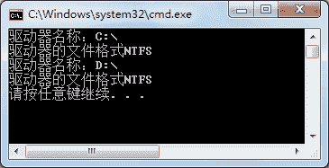

# C# Driveinfo：获取计算机驱动器信息

> 原文：[`c.biancheng.net/view/2914.html`](http://c.biancheng.net/view/2914.html)

查看计算机驱动器信息主要包括查看磁盘的空间、磁盘的文件格式、磁盘的卷标等，在 C# 语言中这些操作可以通过 Driveinfo 类来实现。

Driveinfo 类是一个密封类，即不能被继承，其仅提供了一个构造方法，语法形式如下。

Driveinfo(string driveName)

其中，dirveName 参数是指有效驱动器路径或驱动器号，Null 值是无效的。

创建 Driveinfo 类的实例的代码如下。

```

Driveinfo driveInfo=new Driveinfo("C");
```

上面的代码创建了磁盘的盘符是 C 的驱动器实例，通过该实例能获取该盘符下的信息， 包括磁盘的名称、磁盘的格式等。

Driveinfo 类中的常用属和方法如下表所示。

| 属性或方法 | 作用 |
| AvailableFreeSpace | 只读属性，获取驱动器上的可用空闲空间量 (以字节为单位) |
| DriveFormat | 只读属性，获取文件系统格式的名称，例如 NTFS 或 FAT32 |
| DriveType | 只读属性，获取驱动器的类型，例如 CD-ROM、可移动驱动器、网络驱动器或固定驱动器 |
| IsReady | 只读属性，获取一个指示驱动器是否已准备好的值，True 为准备好了， False 为未准备好 |
| Name | 只读属性，获取驱动器的名称，例如 C:\ |
| RootDirectory | 只读属性，获取驱动器的根目录 |
| TotalFreeSpace | 只读属性，获取驱动器上的可用空闲空间总量 (以字节为单位) |
| TotalSize | 只读属性，获取驱动器上存储空间的总大小 (以字节为单位) |
| VolumeLabel | 属性， 获取或设置驱动器的卷标 |
| Driveinfo[] GetDrives() | 静态方法，检索计算机上所有逻辑驱动器的驱动器名称 |

下面通过实例来演示 Driveinfo 类的使用。

【实例 1】获取 D 盘中的驱动器类型、名称、文件系统名称、可用空间以及总空间大小。

根据题目要求，代码如下。

```

class Program
{
    static void Main(string[] args)
    {
        DriveInfo driveInfo = new DriveInfo("D");
        Console.WriteLine("驱动器的名称：" + driveInfo.Name);
        Console.WriteLine("驱动器类型：" + driveInfo.DriveType);
        Console.WriteLine("驱动器的文件格式：" + driveInfo.DriveFormat);
        Console.WriteLine("驱动器中可用空间大小：" + driveInfo.TotalFreeSpace);
        Console.WriteLine("驱动器总大小：" + driveInfo.TotalSize);
    }
}
```

执行上面的代码，效果如下图所示。


驱动器类型中的 Fixed 值代表的本地磁盘、驱动器中可用空间的大小和总大小的单位是字节 (B)。

如果需要对空间大小的单位进行转换，按照规则进行运算即可，即 1KB=1024B，1MB=1024KB，1GB=1024MB。

【实例 2】获取计算机中所有驱动器的名称和文件格式。

根据题目要求，需要使用 GetDrives 方法获取所有驱动器，代码如下。

```

class Program
{
    static void Main(string[] args)
    {
        DriveInfo[] driveInfo = DriveInfo.GetDrives();
        foreach(DriveInfo d in driveInfo)
        {
            if (d.IsReady)
            {
                Console.WriteLine("驱动器名称：" + d.Name);
                Console.WriteLine("驱动器的文件格式" + d.DriveFormat);
            }
        }
    }
}
```

执行上面的代码，效果如下图所示。


从上面的执行效果可以看出，在当前计算机中共有 2 个可用磁盘，文件格式都是 NTFS。