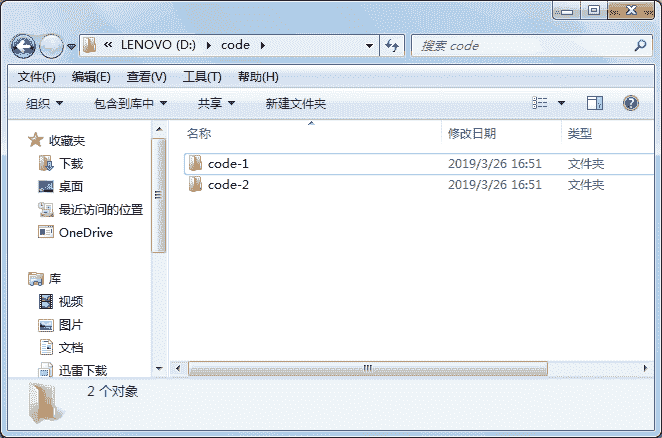
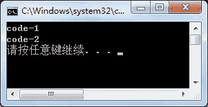

# C# Directoryinfo 类：文件夹操作

> 原文：[`c.biancheng.net/view/2915.html`](http://c.biancheng.net/view/2915.html)

在 C# 语言中 Directory 类和 Directoryinfo 类都是对文件夹进行操作的。

关于 Directory 类的使用将在下一节《C# Directory》中为大家讲解。

DirectoryInfo 类能创建该类的实例，通过类的实例访问类成员。

DirectoryInfo 类提供了一个构造方法，语法形式如下。

DirectoryInfo(string path)

在这里 path 参数用于指定文件的目录，即路径。

例如创建路径为 D 盘中的 test 文件夹的实例，代码如下。

DirectoryInfo directoryInfo = new DirectoryInfo("D:\\test");

需要注意的是路径中如果使用 `\`，要使用转义字符来表示，即 `\\`；或者在路径中将 `\` 字符换成 `/`。

DirectoryInfo 类中常用的属性和方法如下表所示。

| 属性或方法 | 作用 |
| Exists | 只读属性，获取指示目录是否存在的值 |
| Name | 只读属性，获取 Directorylnfo 实例的目录名称 |
| Parent | 只读属性，获取指定的子目录的父目录 |
| Root | 只读属性，获取目录的根部分 |
| void Create() | 创建目录 |
| DirectoryInfo CreateSubdirectory(string path) | 在指定路径上创建一个或多个子目录 |
| void Delete() | 如果目录中为空，则将目录删除 |
| void Delete(bool recursive) | 指定是否删除子目录和文件，如果 recursive 参数的值为 True，则删除，否则不删除 |
| IEnumerable<DirectoryInfo>  EnumerateDirectories() | 返回当前目录中目录信息的可枚举集合 |
| IEnumerable<DirectoryInfo>  EnumerateDirectories(string searchPattern) | 返回与指定的搜索模式匹配的目录信息的可枚举集合 |
| IEnumerable<FileInfo> EnumerateFiles()  | 返回当前目录中的文件信息的可枚举集合 |
| IEnumerable<FileInfo> EnumerateFiles(string searchPattern) | 返回与搜索模式匹配的文件信息的可枚举集合 |
| IEnumerable<FileSystemInfo>  EnumerateFileSystemInfos()  | 返回当前目录中的文件系统信息的可枚举集合 |
| IEnumerable<FileSystemInfo>  EnumerateFileSystemInfos(string searchPattern) | 返回与指定的搜索模式匹配的文件系统信息的可枚举集合 |
| DirectoryInfo[] GetDirectories() | 返回当前目录的子目录 |
| DirectoryInfo[] GetDirectories(string searchPattern) | 返回匹配给定的搜索条件的当前目录 |
| FileInfo[] GetFiles() | 返回当前目录的文件列表 |
| FileInfo[] GetFiles(string searchPattern) | 返回当前目录中与给定的搜索模式匹配的文件列表 |
| FileSystemInfo[] GetFileSystemInfos() | 返回所有文件和目录的子目录中的项 |
| FileSystemInfo[] GetFileSystemInfos(string searchPattern) | 返回与指定的搜索条件匹配的文件和目录的子目录中的项 |
| void MoveTo(string destDirName)  | 移动 DirectoryInfo 实例中的目录到新的路径 |

下面通过实例来演示 DirectoryInfo 类的使用。

【实例 1】在 D 盘下创建文件夹 code，并在该文件夹中创建 code-1 和 code-2 两个子文件夹。

根据题目要求，代码如下。

```

class Program
{
    static void Main(string[] args)
    {
        DirectoryInfo directoryInfo = new DirectoryInfo("D:\\code");
        directoryInfo.Create();
        directoryInfo.CreateSubdirectory("code-1");
        directoryInfo.CreateSubdirectory("code-2");
    }
}
```

执行上面的代码即可完成相关文件夹的创建。磁盘中的目录结构如下图所示。


需要注意的是，在创建文件夹时即使磁盘上存在同名文件夹也可以直接创建，不会出现异常。

【实例 2】查看 D 盘下 code 文件夹中的文件夹。

根据题目要求，代码如下。

```

class Program
{
    static void Main(string[] args)
    {
        DirectoryInfo directoryInfo = new DirectoryInfo("D:\\code");
        IEnumerable<DirectoryInfo> dir = directoryInfo.EnumerateDirectories();
        foreach(var v in dir)
        {
            Console.WriteLine(v.Name);
        }
    }
}
```

执行上面的代码，效果如下图所示。


从上面的执行效果可以看出，在 code 文件夹下共有两个文件。

需要注意的是，EnumerateDirectories 方法只用于检索文件夹，不能检索文件。

【实例 3】将 code 文件夹及其含有的子文件夹删除。

根据题目要求，使用 Delete 方法即可完成文件删除的操作，为了演示删除操作的效果,

在 code 文件夹中的 code-1 和 code-2 中分别添加一个 Word 文件。具体代码如下。

```

class Program
{
    static void Main(string[] args)
    {
        DirectoryInfo directoryInfo = new DirectoryInfo("D:\\code");
        directoryInfo.Delete(true);
    }
}
```

执行上面的代码即可将文件夹 code 删除。

需要注意的是，如果要删除一个非空文件夹，则要使用 Delete(True) 方法将文件夹中的文件一并删除，否则会岀现“文件夹不为空”的异常。