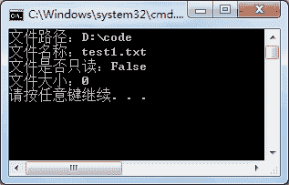

# C# FileInfo 类：文件操作

> 原文：[`c.biancheng.net/view/2919.html`](http://c.biancheng.net/view/2919.html)

C# 语言中 File 类和 FileInfo 类都是用来操作文件的，并且作用相似，它们都能完成对文件的创建、更改文件的名称、删除文件、移动文件等操作。

File 类是静态类，其成员也是静态的，通过类名即可访问类的成员；FileInfo 类不是静态成员，其类的成员需要类的实例来访问。

本节主要讲解 FileInfo 类的使用，关于 File 类的使用将在下一节《C# File》中为大家讲解。

在 FileInfo 类中提供了一个构造方法，语法形式如下。

FileInfo(string fileName)

在这里 fileName 参数用于指定新文件的完全限定名或相对文件名。

FileInfo 类中常用的属性和方法如下表所示。

| 属性或方法 | 作用 |
| Directory | 只读属性，获取父目录的实例 |
| DirectoryName | 只读属性，获取表示目录的完整路径的字符串 |
| Exists | 只读属性，获取指定的文件是否存在，若存在返回 True，否则返回 False |
| IsReadOnly | 属性，获取或设置指定的文件是否为只读的 |
| Length | 只读属性，获取文件的大小 |
| Name | 只读属性，获取文件的名称 |
| Filelnfo CopyTo(string destFileName) | 将现有文件复制到新文件，不允许覆盖现有文件 |
| Filelnfo CopyTo(string destFileName, bool overwrite) | 将现有文件复制到新文件，允许覆盖现有文件 |
| FileStream Create() | 创建文件 |
| void Delete() | 删除文件 |
| void MoveTo(string destFileName) | 将指定文件移到新位置，提供要指定新文件名的选项 |
| Filelnfo Replace(string destinationFileName, string destinationBackupFileName) | 使用当前文件对象替换指定文件的内容，先删除原始文件， 再创建被替换文件的备份 |

下面通过实例来演示 FileInfo 类的应用。

【实例】在 D 盘的 code 文件夹下创建名为 test1.txt 的文件，并获取该文件的相关属性，然后将其移动到 D 盘下的 code-1 文件夹中。

根据题目要求，代码如下。

```

class Program
{
    static void Main(string[] args)
    {
        //在 D 盘下创建 code 文件夹
        Directory.CreateDirectory("D:\\code");
        FileInfo fileInfo = new FileInfo("D:\\code\\test1.txt");
        if (!fileInfo.Exists)
        {
            //创建文件
            fileInfo.Create().Close();
        }
        fileInfo.Attributes = FileAttributes.Normal;//设置文件属性
        Console.WriteLine("文件路径："+ fileInfo.Directory);
        Console.WriteLine("文件名称："+ fileInfo.Name);
        Console.WriteLine("文件是否只读："+ fileInfo.IsReadOnly);
        Console.WriteLine("文件大小：" +fileInfo.Length);
        //先创建 code-1 文件夹
        //将文件移动到 code-1 文件夹下
        Directory.CreateDirectory("D:\\code-1");
        //判断目标文件夹中是否含有文件 test1.txt
        FileInfo newFileInfo = new FileInfo("D:\\code-1\\test1.txt");
        if (!newFileInfo.Exists)
        {
            //移动文件到指定路径
            fileInfo.MoveTo("D:\\code-1\\test1.txt");
        }
    }
}
```

执行上面的代码，效果如下图所示。


执行代码后 test1.txt 文件已经被移动到 code-1 中。