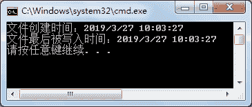

# C# File 类：文件操作

> 原文：[`c.biancheng.net/view/2920.html`](http://c.biancheng.net/view/2920.html)

C# 语言中 File 类同样可以完成与 FileInfo 类相似的功能，但 File 类中也提供了一些不同的方法。

File 类中获取或设置文件信息的常用方法如下表所示。

| 属性或方法 | 作用 |
| DateTime GetCreationTime(string path) | 返回指定文件或目录的创建日期和时间 |
| DateTime GetLastAccessTime(string path)  | 返回上次访问指定文件或目录的日期和时间 |
| DateTime GetLastWriteTime(string path) | 返回上次写入指定文件或目录的日期和时间 |
| void SetCreationTime(string path, DateTime creationTime) | 设置创建该文件的日期和时间 |
| void SetLastAccessTime(string path, DateTime lastAccessTime) | 设置上次访问指定文件的日期和时间 |
| void SetLastWriteTime(string path, DateTime lastWriteTime) | 设置上次写入指定文件的日期和时间 |

File 类是静态类，所提供的类成员也是静态的，调用其类成员直接使用 File 类的名称调用即可。

【实例】将上一节《C# FileInfo》实例中实现的内容使用 File 类完成。

根据题目要求，代码如下。

```

class Program
{
    static void Main(string[] args)
    {
        //在 D 盘下创建 code 文件夹
        Directory.CreateDirectory("D:\\code");
        Directory.CreateDirectory("D:\\code-1");
        string path = "D:\\code\\test1.txt";
        //创建文件
        FileStream fs = File.Create(path);
        //获取文件信息
        Console.WriteLine("文件创建时间：" + File.GetCreationTime(path));
        Console.WriteLine("文件最后被写入时间：" + File.GetLastWriteTime(path));
        //关闭文件流
        fs.Close();
        //设置目标路径
        string newPath = "D:\\code-1\\test1.txt";
        //判断目标文件是否存在
        bool flag = File.Exists(newPath);
        if (flag)
        {
            //删除文件
            File.Delete(newPath);
        }
        File.Move(path, newPath);
    }
}
```

执行上面的代码，效果如下图所示。


在实际应用中，与 File 类相比使用 Fileinfo 类完成文件的操作是比较常用的。