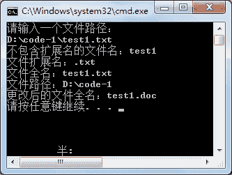

# C# Path 类：文件路径操作

> 原文：[`c.biancheng.net/view/2922.html`](http://c.biancheng.net/view/2922.html)

在 C# 语言中 Path 类主要用于文件路径的一些操作，它也是一个静态类。

Path 类中常用的属性和方法如下表所示。

| 属性或方法 | 作用 |
| string ChangeExtension(string path, string extension) | 更改路径字符串的扩展名 |
| string Combine(params string[] paths) | 将字符串数组组合成一个路径 |
| string Combine(string path1, string path2) | 将两个字符串组合成一个路径 |
| string GetDirectoryName(string path) | 返回指定路径字符串的目录信息 |
| string GetExtension(string path) | 返回指定路径字符串的扩展名 |
| string GetFileName(string path) | 返回指定路径字符串的文件名和扩展名 |
| string GetFileNameWithoutExtension(string path) | 返回不具有扩展名的指定路径字符串的文件名 |
| string GetFullPath(string path) | 返回指定路径字符串的绝对路径 |
| char[] GetInvalidFileNameChars() | 获取包含不允许在文件名中使用的字符的数组 |
| char[] GetInvalidPathChars() | 获取包含不允许在路径名中使用的字符的数组 |
| string GetPathRoot(string path) | 获取指定路径的根目录信息 |
| string GetRandomFileName() | 返回随机文件夹名或文件名 |
| string GetTempPath() | 返回当前用户的临时文件夹的路径 |
| bool HasExtension(string path) | 返回路径是否包含文件的扩展名 |
| bool IsPathRooted(string path) | 返回路径字符串是否包含根 |

下面通过实例来演示 Path 类的应用。

【实例】从控制台输入一个路径，输出该路径的不含扩展名的路径、扩展名、文件全 名、文件路径、更改文件扩展名。

根据题目要求，代码如下。

```

class Program
{
    static void Main(string[] args)
    {
        Console.WriteLine("请输入一个文件路径：");
        string path = Console.ReadLine();
        Console.WriteLine("不包含扩展名的文件名：" + Path.GetFileNameWithoutExtension(path));
        Console.WriteLine("文件扩展名：" + Path.GetExtension(path));
        Console.WriteLine("文件全名：" + Path.GetFileName(path));
        Console.WriteLine("文件路径：" + Path.GetDirectoryName(path));
        //更改文件扩展名
        string newPath = Path.ChangeExtension(path, "doc");
        Console.WriteLine("更改后的文件全名：" + Path.GetFileName(newPath));
    }
}
```

执行上面的代码，效果如下图所示。


从上面的执行效果可以看出，使用 Path 类能很方便地获取与文件路径相关的信息。