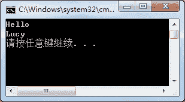

# C# StreamReader 类：读取文件

> 原文：[`c.biancheng.net/view/2925.html`](http://c.biancheng.net/view/2925.html)

在 C# 语言中 StreamReader 类用于从流中读取字符串。它继承自 TextReader 类。

StreamReader 类的构造方法有很多，这里介绍一些常用的构造方法，如下表所示。

| 构造方法 | 说明 |
| StreamReader(Stream stream) | 为指定的流创建 StreamReader 类的实例 |
| StreamReader(string path) | 为指定路径的文件创建 StreamReader 类的实例 |
| StreamReader(Stream stream, Encoding encoding)  | 用指定的字符编码为指定的流初始化 StreamReader 类的一个新实例 |
| StreamReader(string path, Encoding encoding) | 用指定的字符编码为指定的文件名初始化  StreamReader 类的一个新实例 |

使用该表中的构造方法即可创建 StreamReader 类的实例，通过实例调用其提供的类成 员能进行文件的读取操作。

StreamReader 类中的常用属性和方法如下表所示。

| 属性或方法 | 作用 |
| Encoding CurrentEncoding | 只读属性，获取当前流中使用的编码方式 |
| bool EndOfStream | 只读属性，获取当前的流位置是否在流结尾 |
| void Close() | 关闭流 |
| int Peek() | 获取流中的下一个字符的整数，如果没有获取到字符， 则返回 -1 |
| int Read() | 获取流中的下一个字符的整数 |
| int Read(char[] buffer, int index, int count) | 从指定的索引位置开始将来自当前流的指定的最多字符读到缓冲区 |
| string ReadLine() | 从当前流中读取一行字符并将数据作为字符串返回 |
| string ReadToEnd() | 读取来自流的当前位置到结尾的所有字符 |

下面通过实例来演示 StreamReader 类的应用。

【实例】读取 D 盘 code 文件夹下 test.txt 文件中的信息。

根据题目要求，先在 D 盘下创建文件夹并创建 test.txt 文件，然后写入两行字符，分别是 Hello 和 Lucy，代码如下。

```

class Program
{
    static void Main(string[] args)
    {
        //定义文件路径
        string path = @"D:\\code\\test.txt";
        //创建 StreamReader 类的实例
        StreamReader streamReader = new StreamReader(path);
        //判断文件中是否有字符
        while (streamReader.Peek() != -1)
        {
            //读取文件中的一行字符
            string str = streamReader.ReadLine();
            Console.WriteLine(str);
        }
        streamReader.Close();
    }
}
```

执行上面的代码，效果如下图所示。


在读取文件中的信息时，除了可以使用 ReadLine 方法以外，还可以使用 Read、ReadToEnd 方法来读取。