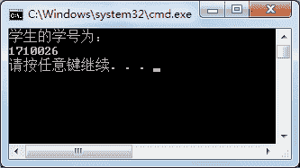

# C# FileStream 类：文件读写

> 原文：[`c.biancheng.net/view/2928.html`](http://c.biancheng.net/view/2928.html)

在 C# 语言中文件读写流使用 FileStream 类来表示，FileStream 类主要用于文件的读写，不仅能读写普通的文本文件，还可以读取图像文件、声音文件等不同格式的文件。

在创建 FileStream 类的实例时还会涉及多个枚举类型的值， 包括 FileAccess、FileMode、FileShare、FileOptions 等。

FileAccess 枚举类型主要用于设置文件的访问方式，具体的枚举值如下。

*   Read：以只读方式打开文件。
*   Write：以写方式打开文件。
*   ReadWrite：以读写方式打开文件。

FileMode 枚举类型主要用于设置文件打开或创建的方式，具体的枚举值如下。

*   CreateNew：创建新文件，如果文件已经存在，则会抛出异常。
*   Create：创建文件，如果文件不存在，则删除原来的文件，重新创建文件。
*   Open：打开已经存在的文件，如果文件不存在，则会抛出异常。
*   OpenOrCreate：打开已经存在的文件，如果文件不存在，则创建文件。
*   Truncate：打开已经存在的文件，并清除文件中的内容，保留文件的创建日期。如果文件不存在，则会抛出异常。
*   Append：打开文件，用于向文件中追加内容，如果文件不存在，则创建一个新文件。

FileShare 枚举类型主要用于设置多个对象同时访问同一个文件时的访问控制，具体的枚举值如下。

*   None：谢绝共享当前的文件。
*   Read：允许随后打开文件读取信息。
*   ReadWrite：允许随后打开文件读写信息。
*   Write：允许随后打开文件写入信息。
*   Delete：允许随后删除文件。
*   Inheritable：使文件句柄可由子进程继承。

FileOptions 枚举类型用于设置文件的高级选项，包括文件是否加密、访问后是否删除等，具体的枚举值如下。

*   WriteThrough：指示系统应通过任何中间缓存、直接写入磁盘。
*   None：指示在生成 System.IO.FileStream 对象时不应使用其他选项。
*   Encrypted：指示文件是加密的，只能通过用于加密的同一用户账户来解密。
*   DeleteOnClose：指示当不再使用某个文件时自动删除该文件。
*   SequentialScan：指示按从头到尾的顺序访问文件。
*   RandomAccess：指示随机访问文件。
*   Asynchronous：指示文件可用于异步读取和写入。

FileStream 类的构造方法有很多，这里介绍一些常用的构造方法，如下表所示。

| 构造方法 | 说明 |
| FileStream(string path, FileMode mode) | 使用指定路径的文件、文件模式创建 FileStream 类的实例 |
| FileStream(string path, FileMode mode, FileAccess access) | 使用指定路径的文件、文件打开模式、文件访问模式创建 FileStream 类的实例 |
| FileStream(string path, FileMode mode, FileAccess access, FileShare share) | 使用指定的路径、创建模式、读写权限和共享权限创建 FileStream 类的一个新实例 |
| FileStream(string path, FileMode mode, FileAccess access, FileShare share, int bufferSize, FileOptions options) | 使用指定的路径、创建模式、读写权限和共享权限、其他 文件选项创建 FileStream 类的实例 |

下面使用 FileStream 类的构造方法创建 FileStream 类的实例，语法形式如下。

```

string path = "D:\\test.txt";
FileStream fileStream1 = new FileStream(path, FileMode.Open);
FileStream fileStream2 = new FileStream(path, FileMode.Open, FileAccess.Read);
FileStream fileStream3 = new FileStream(path, FileMode.Open, FileAccess.ReadWrite, FileShare.Read);
FileStream fileStream4 = new FileStream(path, FileMode.Open, FileAccess.Read, FileShare.Read, 10, FileOptions.None);
```

在创建好 FileStream 类的实例后，即可调用该类中的成员完成读写数据的操作。

FileStream 类中常用的属性和方法如下图所示。

| 属性或方法 | 作用 |
| bool CanRead | 只读属性，获取一个值，该值指示当前流是否支持读取 |
| bool CanSeek | 只读属性，获取一个值，该值指示当前流是否支持查找 |
| bool CanWrite | 只读属性，获取一个值，该值指示当前流是否支持写入 |
| bool IsAsync | 只读属性，获取一个值，该值指示 FileStream 是异步还 是同步打开的 |
| long Length | 只读属性，获取用字节表示的流长度 |
| string Name | 只读属性，获取传递给构造方法的 FileStream 的名称 |
| long Position | 属性，获取或设置此流的当前位置 |
| int Read(byte[] array, int offset, int count) | 从流中读取字节块并将该数据写入给定缓冲区中 |
| int ReadByte() | 从文件中读取一个字节，并将读取位置提升一个字节 |
| long Seek(lorig offset, SeekOrigin origin) | 将该流的当前位置设置为给定值 |
| void Lock(long position, long length) | 防止其他进程读取或写入 System.IO.FileStream |
| void Unlock(long position, long length) | 允许其他进程访问以前锁定的某个文件的全部或部分 |
| void Write(byte[] array, int offset, int count) | 将字节块写入文件流 |
| void WriteByte(byte value) | 将一个字节写入文件流中的当前位置 |

下面通过实例来演示 FileStream 类的应用。

【实例 1】在 D 盘 code 文件夹的 student.txt 文件中写入学生的学号信息。

根据题目要求，代码如下。

如果是中文的，bytes 数组的长度将不够用，改成使用`byte[] bytes= Encoding.UTF8.GetBytes(message);`的方式将数据从字符串类型转换为字节类型。

```

class Program
{
    static void Main(string[] args)
    {
        //定义文件路径
        string path = @"D:\\code\\student.txt";
        //创建 FileStream 类的实例
        FileStream fileStream = new FileStream(path, FileMode.OpenOrCreate, FileAccess.ReadWrite, FileShare.ReadWrite);
        //定义学号
        string msg = "1710026";
        //将字符串转换为字节数组
        byte[] bytes = Encoding.UTF8.GetBytes(msg);
        //向文件中写入字节数组
        fileStream.Write(bytes, 0, bytes.Length);
        //刷新缓冲区
        fileStream.Flush();
        //关闭流
        fileStream.Close();
    }
}
```

执行上面的代码，即可将学生的学号写入到文件 student.txt 中。

【实例 2】从 D 盘的 code 文件夹中将 student.txt 文件中的学号读取出来，并显示到控制台上。

根据题目要求，代码如下。

```

class Program
{
    static void Main(string[] args)
    {
        //定义文件路径
        string path = @"D:\\code\\student.txt";
        //判断是否含有指定文件
        if (File.Exists(path))
        {
            FileStream fileStream = new FileStream(path, FileMode.Open, FileAccess.Read);
            //定义存放文件信息的字节数组
            byte[] bytes = new byte[fileStream.Length];
            //读取文件信息
            fileStream.Read(bytes, 0, bytes.Length);
            //将得到的字节型数组重写编码为字符型数组
            char[] c = Encoding.UTF8.GetChars(bytes);
            Console.WriteLine("学生的学号为：");
            //输出学生的学号
            Console.WriteLine(c);
            //关闭流
            fileStream.Close();
        }
        else
        {
            Console.WriteLine("您查看的文件不存在！");
        }
    }
}
```

执行上面的代码，效果如下图所示。


从上面的执行效果可以看出，已经将文件 student.txt 中的学号信息读取出来。