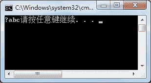

# C# BinaryReader 类：读取二进制文件

> 原文：[`c.biancheng.net/view/2929.html`](http://c.biancheng.net/view/2929.html)

在 C# 以二进制形式读取数据时使用的是 BinaryReader 类。

BinaryReader 类中提供的构造方法有 3 种，具体的语法形式如下。

第 1 种形式：

BinaryReader(Stream input)   //其中，input 参数是输入流。

第 2 种形式：

<pclass>BinaryReader(Stream input, Encoding encoding)   //其中，input 是指输入流，encoding 是指编码方式。</pclass>

第 3 种形式：

BinaryReader(Stream input, Encoding encoding, bool leaveOpen)  //其中，input 是指输入流，encoding 是指编码方式，leaveOpen 是指在流读取后是否包括流的打开状态。

下面分别使用不同的构造方法创建 BinaryReader 类的实例，代码如下。

```

//创建文件流的实例
FileStream fileStream = new FileStream("D:\\code\\test.txt", FileMode.Open);
BinaryReader binaryReader1 = new BinaryReader(fileStream);
BinaryReader binaryReader2 = new BinaryReader(fileStream, Encoding.UTF8);
BinaryReader binaryReader3 = new BinaryReader(fileStream, Encoding.UTF8, true);
```

在完成 BinaryReader 类的实例的创建后，即可完成对文件以二进制形式的读取。

BinaryReader 类中的常用属性和方法如下表所示。

| 属性或方法 | 作用 |
| int Read() | 从指定的流中读取字符 |
| int Read(byte[] buffer, int index, int count) | 以 index 为字节数组中的起始点，从流中读取 count 个字节 |
| int Read(char[] buffer, int index, int count) | 以 index 为字符数组的起始点，从流中读取 count 个字符 |
| bool ReadBoolean() | 从当前流中读取 Boolean 值，并使该流的当前位置提升 1 个字节 |
| byte ReadByte() | 从当前流中读取下一个字节，并使流的当前位置提升 1 个字节 |
| byte[] ReadBytes(int count) | 从当前流中读取指定的字节数写入字节数组中，并将当前 位置前移相应的字节数 |
| char ReadChar() | 从当前流中读取下一个字符，并根据所使用的 Encoding 和从流中读取的特定字符提升流的当前位置 |
| char[] ReadChars(int count) | 从当前流中读取指定的字符数，并以字符数组的形式返回 数据，然后根据所使用的 Encoding 和从流中读取的特定字符将当前位置前移 |
| decimal ReadDecimal() | 从当前流中读取十进制数值，并将该流的当前位置提升 16 个字节 |
| double ReadDouble() | 从当前流中读取 8 字节浮点值，并使流的当前位置提升 8 个字节 |
| short ReadInt16() | 从当前流中读取 2 字节有符号整数，并使流的当前位置提升 2 个字节 |
| int ReadInt32() | 从当前流中读取 4 字节有符号整数，并使流的当前位置提升 4 个字节 |
| long ReadInt64() | 从当前流中读取 8 字节有符号整数，并使流的当前位置提升 8 个字节 |
| sbyte ReadSByte() | 从该流中读取 1 个有符号字节，并使流的当前位置提升 1 个字节 |
| float ReadSingle() | 从当前流中读取 4 字节浮点值，并使流的当前位置提升 4 个字节 |
| string ReadString() | 从当前流中读取一个字符串。字符串有长度前缀，一次 7 位地被编码为整数 |
| ushort ReadUInt16() | 从该流中读取的 2 字节无符号整数 |
| uint ReadUInt32() | 从该流中读取的 4 字节无符号整数 |
| ulong ReadUInt64()  | 从该流中读取的 8 字节无符号整数 |
| void FillBuffer(int numBytes) | 用从流中读取的指定字节数填充内部缓冲区 |

在 BinaryReader 类中提供的方法并不是直接读取文件中指定数据类型的值，而是读取由 BinaryWriter 类写入到文件中的。

在上述方法中只有 Read 方法不要求读取的值必须由 BinaryWriter 类写入到文件中。

下面通过实例来演示 BinaryReader 类中 Read 方法的使用。

【实例 1】使用 BinaryReader 类读取记事本文件中的信息。

根据题目要求，在 D:\code 目录下创建一个记事本文件，并在其中输入 abc，使用 BinaryReader 类读取文件中的内容，代码如下。

```

class Program
{
    static void Main(string[] args)
    {
        FileStream fileStream = new FileStream(@"D:\\code\\test.txt", FileMode.Open);
        BinaryReader binaryReader = new BinaryReader(fileStream);
        //读取文件的一个字符
        int a = binaryReader.Read();
        //判断文件中是否含有字符，若不含字符，a 的值为 -1
        while(a!= -1)
        {
            //输出读取到的字符
            Console.Write((char)a);
            a = binaryReader.Read();
        }
    }
}
```

执行上面的代码，效果如下图所示。


除了使用 Read 方法每次读取一个字符以外，也可以使用 Read 方法的其他重载方法将字符读取到一个字节数组或字符数组中。

【实例 2】将 test.txt 记事本中的内容读取到字节数组中。

根据题目要求，代码如下。

```

class Program
{
    static void Main(string[] args)
    {
        FileStream fileStream = new FileStream(@"D:\\code\\test.txt", FileMode.Open,FileAccess.Read);
        BinaryReader binaryReader = new BinaryReader(fileStream);
        //获取文件长度
        long length = fileStream.Length;
        byte[] bytes = new byte[length];
        //读取文件中的内容并保存到字节数组中
        binaryReader.Read(bytes, 0, bytes.Length);
        //将字节数组转换为字符串
        string str = Encoding.Default.GetString(bytes);
        Console.WriteLine(str);
    }
}
```

执行上面的代码，效果与实例 1 中一致。同样，在读取文件中的内容时也可以将内容存放到字符类型的数组中。