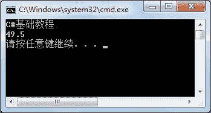

# C# BinaryWriter 类：写入二进制数据

> 原文：[`c.biancheng.net/view/2930.html`](http://c.biancheng.net/view/2930.html)

C# 中 BinaryWriter 类用于向流中写入内容，其构造方法与上一节《C# BinaryReader》中介绍的 BinaryReader 类中的类似，具体的语法形式如下。

第 1 种形式：

BinaryWriter(Stream output)

第 2 种形式：

BinaryWriter(Stream output, Encoding encoding)

第 3 种形式：

BinaryWriter(Stream output, Encoding encoding, bool leaveOpen)

BinaryWriter 类中常用的属性和方法如下表所示。

| 属性或方法 | 作用 |
| void Close() | 关闭流 |
| void Flush() | 清理当前编写器的所有缓冲区，使所有缓冲数据写入基础设备 |
| long Seek(int offset, SeekOrigin origin) | 返回查找的当前流的位置 |
| void Write(char[] chars) | 将字符数组写入当前流 |
| Write7BitEncodedInt(int value) | 以压缩格式写出 32 位整数 |

除了上面的方法以外，Write 方法还提供了多种类型的重载方法。

下面通过实例来演示 BinaryWriter 类的应用。

【实例】在 D 盘 code 文件夹的 test.txt 文件中写入图书的名称和价格，使用 BinaryReader 类读取写入的内容。

根据题目要求，代码如下。

```

class Program
{
    static void Main(string[] args)
    {
        FileStream fileStream = new FileStream(@"D:\\code\\test.txt", FileMode.Open, FileAccess.Write);
        //创建二进制写入流的实例
        BinaryWriter binaryWriter = new BinaryWriter(fileStream);
        //向文件中写入图书名称
        binaryWriter.Write("C#基础教程");
        //向文件中写入图书价格
        binaryWriter.Write(49.5);
        //清除缓冲区的内容，将缓冲区中的内容写入到文件中
        binaryWriter.Flush();
        //关闭二进制流
        binaryWriter.Close();
        //关闭文件流
        fileStream.Close();
        fileStream = new FileStream(@"D:\\code\\test.txt", FileMode.Open, FileAccess.Read);
        //创建二进制读取流的实例
        BinaryReader binaryReader = new BinaryReader(fileStream);
        //输出图书名称
        Console.WriteLine(binaryReader.ReadString());
        //输出图书价格
        Console.WriteLine(binaryReader.ReadDouble());
        //关闭二进制读取流
        binaryReader.Close();
        //关闭文件流
        fileStream.Close();
    }
}
```

执行上面的代码，效果如下图所示。


从上面的执行效果可以看出，使用 BinaryWriter 类可以很方便地将图书名称和价格写入到 test.txt 文件中。