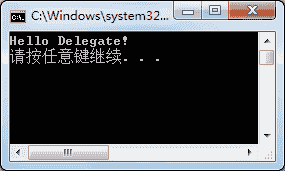
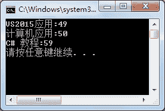

# C#命名方法委托

> 原文：[`c.biancheng.net/view/2935.html`](http://c.biancheng.net/view/2935.html)

在 C# 语言中命名方法委托是最常用的一种委托，其定义的语法形式如下。

修饰符  delegate  返回值类型  委托名 ( 参数列表 );

从上面的定义可以看出，委托的定义与方法的定义是相似的。例如定义一个不带参数的委托，代码如下。

```

public delegate void MyDelegate();
```

在定义好委托后就到了实例化委托的步骤，命名方法委托在实例化委托时必须带入方法的具体名称。

实例化委托的语法形式如下。

委托名  委托对象名 = new 委托名 ( 方法名 );

委托中传递的方法名既可以是静态方法的名称，也可以是实例方法的名称。

需要注意的是，在委托中所写的方法名必须与委托定义时的返回值类型和参数列表相同。

在实例化委托后即可调用委托，语法形式如下。

委托对象名 ( 参数列表 );

在这里，参数列表中传递的参数与委托定义的参数列表相同即可。

下面分别通过两个实例来演示在委托中应用静态方法和实例方法的形式。

【实例 1】创建委托，在委托中传入静态方法于控制台输出“Hello Delegate!”。

根据题目要求，代码如下。

```

class Program
{
    public delegate void MyDelegate();
    static void Main(string[] args)
    {
        MyDelegate myDelegate = new MyDelegate(Test.SayHello);
        myDelegate();
    }
}
class Test
{
    public static void SayHello()
    {
        Console.WriteLine("Hello Delegate!");
    }
}
```

执行上面的代码，效果如下图所示。


若使用静态方法，在向委托中传递方法名时只需要用“`类名.方法名`”的形式。

【实例 2】将实例 1 中的静态方法改成实例方法。

根据题目要求，代码如下。

```

class Program
{
    public delegate void MyDelegate();
    static void Main(string[] args)
    {
        MyDelegate myDelegate = new MyDelegate(new Test().SayHello);
        myDelegate();
    }
}
class Test
{
    public void SayHello()
    {
        Console.WriteLine("Hello Delegate!");
    }
}
```

执行上面的代码，效果与实例 1 中效果一致。

由于在委托中使用的是实例方法，则需要通过类的实例来调用方法，即使用“`new 类名 (). 方法名`”的形式。

除了使用匿名对象的方式调用方法以外，也可以先创建类的实例，再通过类的实例调用方法。

在了解了命名方法委托的写法以后，下面通过一个综合实例来演示命名委托的应用。

【实例 3】使用委托完成将图书信息按照价格升序排序的操作。

根据题目要求，先定义图书信息类，然后定义对图书价格排序的方法。图书信息类的代码如下。

```

class Book:IComparable<Book>
{
    //定义构造方法为图书名称和价格赋值
    public Book(string name,double price)
    {
        Name = name;
        Price = price;
    }
    //定义图书名称属性
    public string Name { get; set; }
    //定义图价格属性
    public double Price { get; set; }
    //实现比较器中比较的方法
    public int CompareTo(Book other)
    {
        return (int)(this.Price - other.Price);
    }
    //重写 ToString 方法，返回图书名称和价格
    public override string ToString()
    {
        return Name + ":" + Price;
    }
    //图书信息排序
    public static void BookSort(Book[] books)
    {
        Array.Sort(books);
    }
}
```

在 Main 方法中定义委托调用图书排序的方法，代码如下。

```

class Program
{
    //定义对图书信息排序的委托
    public delegate void BookDelegate(Book[] books);
    static void Main(string[] args)
    {
        BookDelegate bookDelegate = new BookDelegate(Book.BookSort);
        Book[] book = new Book[3];
        book[0] = new code_1.Book("计算机应用", 50);
        book[1] = new code_1.Book("C# 教程", 59);
        book[2] = new code_1.Book("VS2015 应用", 49);
        bookDelegate(book);
        foreach(Book bk in book)
        {
            Console.WriteLine(bk);
        }
    }
}
```

执行上面的代码，效果如下图所示。


从上面的执行效果可以看出，通过委托调用的图书排序方法 (BookSort) 按照图书价格升序排列了图书信息。

需要注意的是，由于 Book[] 数组是引用类型，因此通过委托调用后其值也发生了相应的变化，即 book 数组中的值已经是完成了排序操作后的结果。