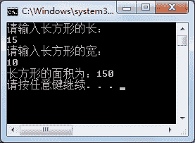

# C#匿名委托

> 原文：[`c.biancheng.net/view/2940.html`](http://c.biancheng.net/view/2940.html)

在 C# 语言中匿名委托是指使用匿名方法注册在委托上，实际上是在委托中通过定义代码块来实现委托的作用，具体的语法形式如下。

//1\. 定义委托
修饰符  delegate  返回值类型  委托名 ( 参数列表 );

//2\. 定义匿名委托
委托名  委托对象 = delegate
{
    //代码块
};

//3\. 调用匿名委托
委托对象名 ( 参数列表 );

通过上面 3 个步骤即可完成匿名委托的定义和调用，需要注意的是，在定义匿名委托时代码块结束后要在 `{}` 后加上分号。

下面通过实例来演示匿名委托的应用。

【委托】使用匿名委托计算长方形的面积。

根据题目要求，代码如下。

```

class Program
{
    public delegate void AreaDelegate(double length, double width);
    static void Main(string[] args)
    {
        Console.WriteLine("请输入长方形的长：");
        double length = double.Parse(Console.ReadLine());
        Console.WriteLine("请输入长方形的宽：");
        double width = double.Parse(Console.ReadLine());
        AreaDelegate areaDelegate = delegate
        {
            Console.WriteLine("长方形的面积为：" + length * width);
        };
        areaDelegate(length, width);
    }
}
```

执行上面的代码，效果如下图所示。


从上面的执行效果可以看岀，在使用匿名委托时并没有定义方法，而是在实例化委托时直接实现了具体的操作。

由于匿名委托并不能很好地实现代码的重用，匿名委托通常适用于实现一些仅需要使用一次委托中代码的情况，并且代码比较少。