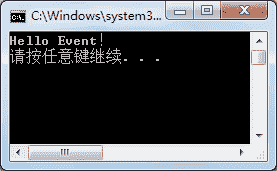

# C#事件：Event

> 原文：[`c.biancheng.net/view/2941.html`](http://c.biancheng.net/view/2941.html)

无论是企业中使用的大型应用程序还是手机中安装的一个 App 都与事件密不可分。

例如在登录 QQ 软件时需要输入用户名和密码，然后单击“登录”按钮来登录 QQ，此时单击按钮的动作会触发一个按钮的单击事件来完成执行相应的代码实现登录的功能。

在 C# 语言中，Windows 应用程序、 ASP.NET 网站程序等类型的程序都离不开事件的应用。

事件是一种引用类型，实际上也是一种特殊的委托。

通常，每一个事件的发生都会产生发送方和接收方，发送方是指引发事件的对象，接收方则是指获取、处理事件。事件要与委托一起使用。

事件定义的语法形式如下。

访问修饰符  event  委托名  事件名 ;

在这里，由于在事件中使用了委托，因此需要在定义事件前先定义委托。

在定义事件后需要定义事件所使用的方法，并通过事件来调用委托。

下面通过实例来演示事件的应用。

【实例 1】通过事件完成在控制台上输岀“Hello Event!”的操作。

根据题目要求，代码如下。

```

class Program
{
    //定义委托
    public delegate void SayDelegate();
    //定义事件
    public event SayDelegate SayEvent;
    //定义委托中调用的方法
    public void SayHello()
    {
        Console.WriteLine("Hello Event！");
    }
    //创建触发事件的方法
    public void SayEventTrigger()
    {
        //触发事件，必须与事件是同名方法
        SayEvent();
    }
    static void Main(string[] args)
    {
        //创建 Program 类的实例
        Program program = new Program();
        //实例化事件，使用委托指向处理方法
        program.SayEvent = new SayDelegate(program.SayHello);
        //调用触发事件的方法
        program.SayEventTrigger();
    }
}
```

执行上面的代码，效果如下图所示。


【实例 2】在事件中使用多播委托完成预定不同商品的操作。

根据题目要求，代码如下。

```

class Program
{
    static void Main(string[] args)
    {
        //创建 MyEvent 类的实例
        MyEvent myEvent = new MyEvent();
        //实例化事件，使用委托指向处理方法
        myEvent.BuyEvent += new MyEvent.BuyDelegate(MyEvent.BuyFood);
        myEvent.BuyEvent += new MyEvent.BuyDelegate(MyEvent.BuyCake);
        myEvent.BuyEvent += new MyEvent.BuyDelegate(MyEvent.BuyFlower);
        //调用触发事件的方法
        myEvent.InvokeEvent();
    }
}
class MyEvent
{
    //定义委托
    public delegate void BuyDelegate();
    //定义事件
    public event BuyDelegate BuyEvent;
    //定义委托中使用的方法
    public static void BuyFood()
    {
        Console.WriteLine("购买快餐！");
    }
    public static void BuyCake()
    {
        Console.WriteLine("购买蛋糕！");
    }
    public static void BuyFlower()
    {
        Console.WriteLine("购买鲜花！");
    }
    //创建触发事件的方法
    public void InvokeEvent()
    {
        //触发事件，必须和事件是同名方法
        BuyEvent();
    }
}
```

执行上面的代码，效果与实例 1 效果一致。

需要注意的是，在使用事件时如果事件的定义和调用不在同一个类中，实例化的事件只能出现在`+=`或者`-=`操作符的左侧。

在上面的代码中，实例化事件的代码只能写成`myEvent.BuyEvent += new MyEvent.BuyDelegate(MyEvent.BuyFood)`的形式，而不能使用`myEvent.BuyEvent = new MyEvent.BuyDelegate(MyEvent.BuyFood)`的形式。

事件是每一个 Windows 应用程序中必备的，很多事件的操作都是自动生成的。