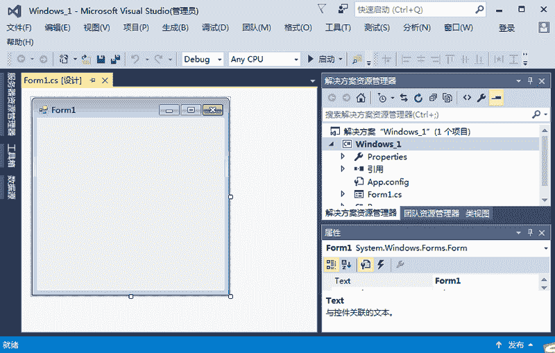

# C#创建 Windows 窗体应用程序（WinForm 程序）

> 原文：[`c.biancheng.net/view/2945.html`](http://c.biancheng.net/view/2945.html)

创建 Windows 窗体应用程序的步骤与创建控制台应用程序的步骤类似，在 Visual Studio 2015 软件中，依次选择“文件”→“新建”→“项目”命令，弹出如下图所示的对话框。


在该对话框中选择“Windows 窗体应用程序”，并更改项目名称、项目位置、解决方案名称等信息，单击“确定”按钮，即可完成 Windows 窗体应用程序的创建，如下图所示。


在每一个 Windows 窗体应用程序的项目文件夹中，都会有一个默认的窗体程序 Form1.cs，并且在项目的 Program.cs 文件中指定要运行的窗体。

Program.cs 文件的代码如下。

```

static class Program
{
    /// <summary>
    /// 应用程序的主入口点。
    /// </summary>
    [STAThread]
    static void Main()
    {
        Application.EnableVisualStyles();
        Application.SetCompatibleTextRenderingDefault(false);
        Application.Run(new Form1());
    }
}
```

在上述代码的 Main 方法中的：

*   第 1 行代码：用于启动应用程序中可视的样式，如果控件和操作系统支持，那么 控件的绘制就能根据显不风格来实现。
*   第 2 行代码：控件支持 UseCompatibleTextRenderingproperty 属性，该方法将此属 性设置为默认值。
*   第 3 行代码：用于设置在当前项目中要启动的窗体，这里 new Form1() 即为要启动的窗体。

在 Windows 窗体应用程序中界面是由不同类型的控件构成的。

系统中默认的控件全部存放到工具箱中，选择“视图”→“工具箱”，如下图所示。


在工具箱中将控件划分为公共控件、容器、菜单和工具栏、数据、组件、打印、对话框等组。

如果工具箱中的控件不能满足开发项目的需求，也可以向工具箱中添加新的控件, 或者对工具箱中的控件重置或进行分组等操作，这都可以通过右击工具箱，在弹出的右键菜单中选择相应的命令实现。

右键菜单如下图所示界面。


在右键菜单中选择“选择项”命令，弹出如下图所示的对话框。


在该对话框中列出了不同组件中所带的控件，如果需要在工具箱中添加，直接选中相应组件名称前的复选框即可。

如果需要添加外部的控件，则单击“浏览”按钮，找到相应控件的 .dll 或 .exe 程序添加即可。

Windows 窗体应用程序也称为事件驱动程序，也就是通过鼠标单击界面上的控件、通过键盘输入操作控件等操作来触发控件的不同事件完成相应的操作。

例如单击按钮、右击界面、向文本框中输入内容等操作。