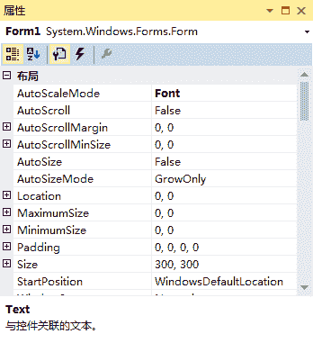
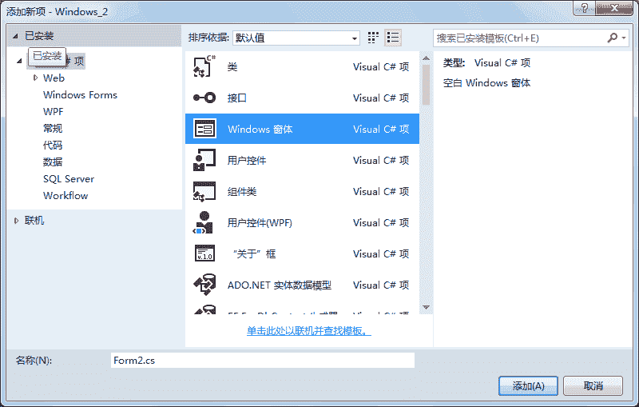
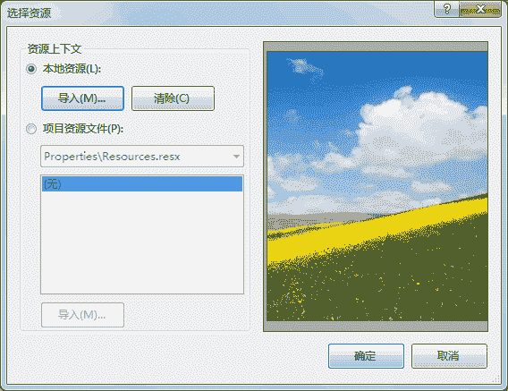

# C#设置窗体属性

> 原文：[`c.biancheng.net/view/2946.html`](http://c.biancheng.net/view/2946.html)

每一个 Windows 窗体应用程序都是由若干个窗体构成的，窗体中的属性主要用于设置窗体的外观。

在 Windows 窗体应用程序中右击窗体，在弹出的右键菜单中 选择“属性”命令，弹出如下图所示的属性面板。


在该图中列出的属性分为布局、窗口样式等方面，合理地设置好窗体的属性对窗体的 展现效果会起到事半功倍的作用。

窗体的常用属性如下表所示。

| 属性 | 作用 |
| Name | 用来获取或设置窗体的名称 |
| WindowState | 获取或设置窗体的窗口状态，取值有 3 种，即 Normal（正常）、Minimized（最小化）、Maximized（最大化），默认为 Normal，即正常显示 |
| StartPosition | 获取或设置窗体运行时的起始位置，取值有 5 种，即 Manual（窗体位置由 Location 属性决定）、CenterScreen（屏幕居中）、WindowsDefaultLocation（ Windows 默认位置）、WindowsDefaultBounds（Windows 默认位置，边界由 Windows 决定）、CenterParent（在父窗体中居中），默认为 WindowsDefaultLocation |
| Text | 获取或设置窗口标题栏中的文字 |
| MaximizeBox | 获取或设置窗体标题栏右上角是否有最大化按钮，默认为 True |
| MinimizeBox | 获取或设置窗体标题栏右上角是否有最小化按钮，默认为 True |
| BackColor | 获取或设置窗体的背景色 |
| BackgroundImage | 获取或设置窗体的背景图像 |
| BackgroundImageLayout | 获取或设置图像布局，取值有 5 种，即 None（图片居左显示）、Tile（图像重复，默认值）、Stretch（拉伸）、Center（居中）、Zoom（按比例放大到合适大小） |
| Enabled | 获取或设置窗体是否可用 |
| Font | 获取或设置窗体上文字的字体 |
| ForeColor | 获取或设置窗体上文字的颜色 |
| Icon | 获取或设置窗体上显示的图标 |

下面通过实例来演示窗体属性的应用。

【实例】创建一个名为 TestForm 的窗体，并完成如下设置。

*   窗体的标题栏中显示“第一个窗体”。
*   窗体中起始位置居中。
*   窗体中设置一个背景图片。
*   窗体中不显示最大化和最小化按钮。

实现题目中要求的窗体，具体步骤如下。

#### 1) 创建名为 TestForm 的窗体

创建一个 Windows 应用程序 Windows-2，然后右击该项目，在弹出的右键菜单中选择“添加新项”命令，弹出如下图所示。



#### 2) 设置 TestForm 窗体的属性

TestForm 窗体的属性设置如下表所示。

| 属性 | 属性值 |
| Name | TestForm |
| StartPosition | CenterScreen |
| Text  | 第一个窗体 |
| MaximizeBox | False |
| MinimizeBox | False |
| Backgroundimage | window_2.jpg |
| BackgroundlmageLayout | Stretch |

在上述属性中除了背景图片 (Backgroundimage) 属性以外，其他属性直接添加上表中对应的属性值即可。

设置背景图片属性 (Backgroimdlmage) 的方法是单击 Backgroundimage 属性后的按钮，在弹出的对话框中单击“导入”按钮。

如下图所示， 选择图片 window_2.jpg 所在的路径，单击“确定”按钮即可完成背景图片属性的设置。



#### 3) 设置 TestForm 窗体为启动窗体

每一个 Windows 窗体应用程序在运行时仅能指定一个启动窗体，设置启动窗体的方式是在项目的 Program.cs 文件中指定。具体的代码如下。

```

static class Program
{
    /// <summary>
    /// 应用程序的主入口点。
    /// </summary>
    [STAThread]
    static void Main()
    {
        Application.EnableVisualStyles();
        Application.SetCompatibleTextRenderingDefault(false);
        Application.Run(new TestForm());    //设置启动窗体
    }
}
```

完成以上 3 步后按 F5 键运行程序，效果如下图所示。

