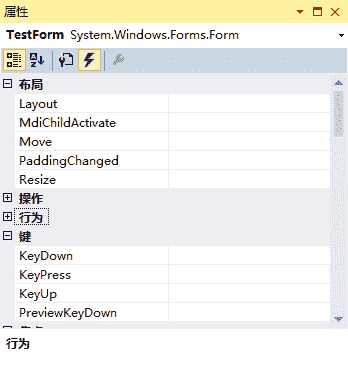
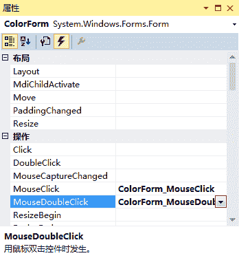
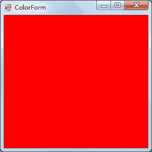

# C#添加窗体事件

> 原文：[`c.biancheng.net/view/2948.html`](http://c.biancheng.net/view/2948.html)

在窗体中除了可以通过设置属性改变外观外，还提供了事件来方便窗体的操作。

在打开操作系统后，单击鼠标或者敲击键盘都可以在操作系统中完成不同的任务，例如双击鼠标打开“我的电脑”、在桌面上右击会出现右键菜单、单击一个文件夹后按 F2 键可以更改文件夹的名称等。

实际上这些操作都是 Windows 操作系统中的事件。

在 Windows 窗体应用程序中系统已经自定义了一些事件，在窗体属性面板中单击闪电图标即可查看到窗体中的事件，如下图所示。


窗体中常用的事件如下表所示。

| 事件 | 作用 |
| Load | 窗体加载事件，在运行窗体时即可执行该事件 |
| MouseClick | 鼠标单击事件 |
| MouseDoubleClick | 鼠标双击事件 |
| MouseMove | 鼠标移动事件 |
| KeyDown | 键盘按下事件 |
| KeyUp | 键盘释放事件 |
| FormClosing | 窗体关闭事件，关闭窗体时发生 |
| FormClosed | 窗体关闭事件，关闭窗体后发生 |

下面通过实例来演示窗体中事件的应用。

【实例】通过窗体的不同事件改变窗体的背景颜色。

在本例中采用的事件分别是窗体加载事件 (Load)、鼠标单击事件 (MouseClick)、鼠标双击事件 (MouseDoubleClick)。

实现该操作的步骤如下。

#### 1) 新建窗体

在上一节《C#窗体属性》中使用的 Windows-2 项目中添加一个名为 ColorForm 的窗体。

#### 2) 添加事件

右击该窗体，在弹出的右键菜单中选择“属性”命令，然后在弹出的面板中单击闪电图标进入窗体事件设置界面。

在该界面中依次选中需要创建的事件，并双击该事件右侧的单元格，系统会自动为其生成对应事件的处理方法，设置后的属性面板如下图所示。


设置好事件后会在 ColorForm 窗体对应的代码文件中自动生成与事件对应的 4 个方法, 代码如下。

```

public partial class ColorForm : Form
{
    public ColorForm()
    {
        InitializeComponent();
    }

    private void ColorForm_MouseClick(object sender, MouseEventArgs e)
    {

    }

    private void ColorForm_MouseDoubleClick(object sender, MouseEventArgs e)
    {

    }

    private void ColorForm_Load(object sender, EventArgs e)
    {

    }
}
```

在执行不同事件时，系统会自动执行事件所对应方法中的内容。

#### 3) 添加事件处理代码

在本例中每个事件完成的操作都是更改窗体的背景颜色，窗体的背景颜色所对应的属性是 BackColor。

除了可以在属性面板中设置外，使用代码设置的方式是使用 this 关键字代表当前窗体的实例，BackColor 属性类型是 Color 枚举类型的，代码如下。

```

this.BackColor = Color.Red;
```

上面的代码是将窗体的背景颜色设置为红色。

下面分别将类似代码添加到每一个事件中，代码如下。

```

public partial class ColorForm : Form
{
    public ColorForm()
    {
        InitializeComponent();
    }

    private void ColorForm_MouseClick(object sender, MouseEventArgs e)
    {
        //设置窗体背景颜色为黑色
        this.BackColor = Color.Black;
    }

    private void ColorForm_MouseDoubleClick(object sender, MouseEventArgs e)
    {
        //设置窗体背景颜色为蓝色
        this.BackColor = Color.Blue;
    }

    private void ColorForm_Load(object sender, EventArgs e)
    {
        //设置窗体颜色为红色
        this.BackColor = Color.Red;
    }
}
```

#### 4) 设置启动窗体

在 Windows-2 项目的 Program.cs 类中将 ColorForm 窗体设置为启动窗体，代码如下。

```

static class Program
{
    /// <summary>
    /// 应用程序的主入口点。
    /// </summary>
    [STAThread]
    static void Main()
    {
        Application.EnableVisualStyles();
        Application.SetCompatibleTextRenderingDefault(false);
        Application.Run(new ColorForm());    //设置启动窗体
    }
}
```

执行上面的代码，效果如下图所示。


在窗体运行后，单击鼠标时窗体的背景颜色会换成黑色，双击鼠标时窗体的背景颜色会换成蓝色。