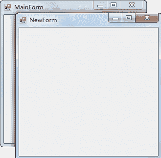

# C#窗体方法

> 原文：[`c.biancheng.net/view/2949.html`](http://c.biancheng.net/view/2949.html)

自定义的窗体都继承自 System.Windows.Form 类，能使用 Form 类中已有的成员，包括属性、方法、事件等。

在前面《C#窗体属性》和《C#窗体事件》中已经分别介绍了窗体中常用的属性和事件。

实际上窗体中也有一些从 System.Windows.Form 类继承的方法，如下表所示。

| 方法 | 作用 |
| void Show() | 显示窗体 |
| void Hide() | 隐藏窗体 |
| DialogResult ShowDialog() | 以对话框模式显示窗体 |
| void CenterToParent() | 使窗体在父窗体边界内居中 |
| void CenterToScreen() | 使窗体在当前屏幕上居中 |
| void Activate() | 激活窗体并给予它焦点 |
| void Close() | 关闭窗体 |

下面通过实例来演示窗体中方法的应用。

【实例】在 MainForm 窗体中单击，弹出一个新窗体 NewForm；在新窗体中单击，将 NewForm 窗体居中，双击，关闭 NewForm 窗体。

实现题目要求的效果需要经过以下步骤：

#### 1) 在项目中添加所需的窗体

在 Windows-2 项目中添加所需的 MainForm 窗体和 NewForm 窗体。

#### 2) 设置 MainForm 窗体中事件

在 MainForm 窗体中添加鼠标单击窗体事件，并在该事件对应的方法中写入打开 NewForm 窗体的代码，具体代码如下。

```

public partial class MainForm : Form
{
    public MainForm()
    {
        InitializeComponent();
    }
    //创建 NewForm 窗体实例
    private void MainForm_MouseClick(object sender, MouseEventArgs e)
    {
        //创建 NewForm 窗体实例
        NewForm newForm = new NewForm();
        //打开 NewForm 窗体
        newForm.Show();
    }
}
```

#### 3) 设置 NewForm 窗体的事件

在 NewForm 窗体中添加鼠标单击事件将窗体的显示位置居中，添加鼠标双击事件关闭 NewForm 窗体，并在相应的事件中添加代码，具体代码如下。

```

public partial class NewForm : Form
{
    public NewForm()
    {
        InitializeComponent();
    }
    //窗体的鼠标单击事件
    private void NewForm_MouseClick(object sender, MouseEventArgs e)
    {
        //将窗体居中
        this.CenterToScreen();
    }
    //窗体的鼠标双击事件
    private void NewForm_MouseDoubleClick(object sender, MouseEventArgs e)
    {
        //关闭窗体
        this.Close();
    }
}
```

#### 4) 将 MainForm 窗体设置为启动窗体

在 Windows-2 项目的 Program.cs 文件中设置 MainForm 窗体为启动窗体，代码如下。

```

static class Program
{
    /// <summary>
    /// 应用程序的主入口点。
    /// </summary>
    [STAThread]
    static void Main()
    {
        Application.EnableVisualStyles();
        Application.SetCompatibleTextRenderingDefault(false);
        Application.Run(new MainForm());    //设置启动窗体
    }
}
```

完成以上步骤后运行该项目，并在 MainForm 窗体上单击鼠标，效果如下图所示。


单击 NewForm 窗体后，NewForm 窗体显示在屏幕中央，双击 NewForm 窗体即可将该窗体关闭。

在使用窗体中的方法时需要注意，如果是当前窗体需要调用方法直接使用 `this` 关键字代表当前窗体，通过`this.方法名 (参数列表)`的方式调用即可。

如果要操作其他窗体，则需要用窗体的实例来调用方法。