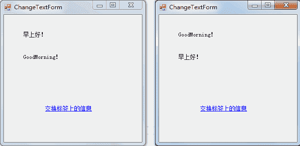

# C# Label 和 LinkLabel：标签控件

> 原文：[`c.biancheng.net/view/2953.html`](http://c.biancheng.net/view/2953.html)

在 Windows 窗体应用程序中，每个窗体都必不可少地会用到文本框和标签控件。

由于在窗体中无法直接编写文本，通常使用标签控件来显示文本。

关于文本框的应用我们将在下一节《C# TextBox》中为大家讲解。

在 Windows 窗体应用程序中，标签控件王要分为普通的标签 (Label) 和超链接形式的标签 (LinkLabel) 。

普通标签 (Label) 控件的常用属性如下表所示。

| 属性名 | 作用 |
| Name | 标签对象的名称，区别不同标签唯一标志 |
| Text | 标签对象上显示的文本 |
| Font | 标签中显示文本的样式 |
| ForeColor | 标签中显示文本的颜色 |
| BackColor | 标签的背景颜色 |
| Image | 标签中显示的图片 |
| AutoSize | 标签的大小是否根据内容自动调整，True 为自动调整，False 为用户自定义大小 |
| Size | 指定标签控件的大小 |
| Visible | 标签是否可见，True 为可见，False 为不可见 |

普通标签控件 (Label) 中的事件与窗体的事件类似，常用的事件主要有鼠标单击事件、 鼠标双击事件、标签上文本改变的事件等。

与普通标签控件类似，超链接标签控件 (LinkLabel) 也具有相同的属性和事件。

超链接标签主要应用的事件是鼠标单击事件，通过单击标签完成不同的操作，例如在 QQ 窗体中注册账号和找回密码的操作。

下面通过实例来演示标签控件的应用。

【实例】创建一个窗体，在窗体上放置两个普通标签控件 (Label)，分别显示“早上好！”和“GoodMorning！”。

在窗体上通过单击超链接标签 (LinkLabel) 交换这两个标签上显示的信息。

根据题目要求，首先创建一个名为 ChangeTextForm 的窗体，并设置所需控件的属性和事件，实现的代码如下。

```

public partial class ChangeTextForm : Form
{
    public ChangeTextForm()
    {
        InitializeComponent();
    }
    //超链接标签控件的单击事件
    private void linkLabel1_LinkClicked(object sender, LinkLabelLinkClickedEventArgs e)
    {
        //交换标签上的信息。
        string temp = label1.Text;
        label1.Text = label2.Text;
        label2.Text = temp;
    }
}
```

> 提示：所需控件可以在工具箱中创建，在控件上右键即可设置相关属性和事件

执行上面的代码，效果如下图所示。

