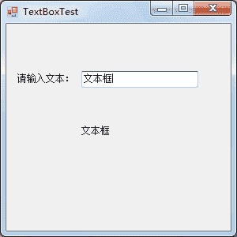
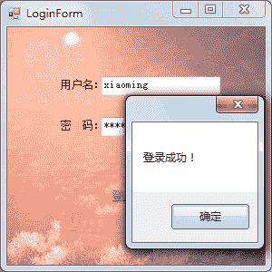

# C# TextBox：文本框控件

> 原文：[`c.biancheng.net/view/2955.html`](http://c.biancheng.net/view/2955.html)

文本框 (TextBox) 是在窗体中输入信息时最常用的控件，通过设置文本框属性可以实现多行文本框、密码框等。

在窗体上输入信息时使用最多的就是文本框。

除了前面《C# Label、LinkLabel》一节介绍的控件属性以外，文本框还有一些不同的属性， 如下表所示。

| 属性名 | 作用 |
| Text | 文本框对象中显示的文本 |
| MaxLength | 在文本框中最多输入的文本的字符个数 |
| WordWrap | 文本框中的文本是否自动换行，如果是 True，则自动换行，如果是 False，则不能自动换行 |
| PasswordChar | 将文本框中出现的字符使用指定的字符替换，通常会使用“*”字符 |
| Multiline | 指定文本框是否为多行文本框，如果为 True，则为多行文本框，如果 为 False，则为单行文本框 |
| ReadOnly | 指定文本框中的文本是否可以更改，如果为 True，则不能更改，即只读文本框，如果为 False，则允许更改文本框中的文本 |
| Lines | 指定文本框中文本的行数 |
| ScrollBars | 指定文本框中是否有滚动条，如果为 True，则有滚动条,如果为 False， 则没有滚动条 |

文本框控件最常使用的事件是文本改变事件 (TextChange)，即在文本框控件中的内容改变时触发该事件。

下面通过实例来演示文本框的应用。

【实例 1】创建一个窗体，在文本框中输入一个值，通过文本改变事件将该文本框中的值写到一个标签中。

根据题目要求，首先创建一个名为 TextBoxTest 的窗体，然后在窗体上添加文本框和标签，并在文本框的文本改变事件中编写代码。

具体的代码如下。

```

public partial class TextBoxTest : Form
{
    public TextBoxTest()
    {
        InitializeComponent();
    }
    //文本框文本改变事件
    private void textBox1_TextChanged(object sender, EventArgs e)
    {
        //将文本框中的文本值显示在标签中
        label2.Text = textBox1.Text;
    }
}
```

运行窗体，效果如下图所示。


从上面的运行结果可以看出，使用控件的属性和事件通过一行代码即可完成所需的功能。

【实例 2】实现简单的登录窗体。

本例中的登录窗体仅包括用户名和密码，将登录窗体命名为 LoginForm。

单击“登录”超链接标签，对文本框中输入的用户名和密码进行判断，如果用户名和密码的输入值分别为 xiaoming 和 123456，则弹出消息框提示“登录成功！”，否则提示“登录失败！”。

具体代码如下。

```

public partial class LoginForm : Form
{
    public LoginForm()
    {
        InitializeComponent();
    }
    //判断是否登录成功
    private void linkLabel1_LinkClicked(object sender, LinkLabelLinkClickedEventArgs e)
    {
        //获取用户名
        string username = textBox1.Text;
        //获取密码
        string password = textBox2.Text;
        //判断用户名密码是否正确
        if ("xiaoming".Equals(username) && "123456".Equals(password))
        {
            MessageBox.Show("登录成功！");
        }
        else
        {
            MessageBox.Show("登录失败！");
        }
    }
}
```

运行窗体后输入用户名和密码，单击“登录”超链接标签，效果如下图所示。


从上面的运行效果可以看出，输入密码的文本框中由于在 PasswordChar 属性中设置了 *，因此在文本框中输入的文本全部使用了 * 来替换。